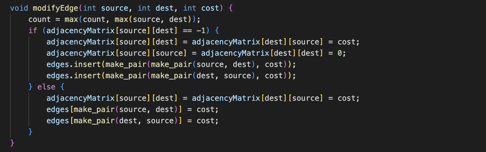
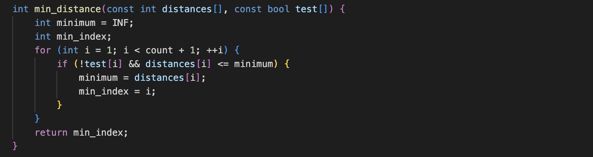

# NetworkTopology Class
#### addEdge(int source, int destination, int cost).

This method is used to add an edge to the network topology. It takes three parameters: source, destination, and cost. It checks if the source and destination nodes are the same and if the topology is already set between them. If not, it adds the edge to the adjacency matrix, updates the edges map, and keeps track of the maximum node count.

 

 

#### removeEdge(int source, int dest).

This method is used to remove an existing edge from the network topology. It takes two parameters: source and dest (destination). It checks if the edge exists in the adjacency matrix, and if so, it removes it from the matrix and the edges map.

 

 

#### modifyEdge(int source, int dest, int cost).

This method is used to modify the cost of an existing edge or add a new edge if it doesn't exist. It takes three parameters: source, dest (destination), and cost. It updates the adjacency matrix, edges map, and the maximum node count. If the edge already exists, it updates its cost; otherwise, it adds the new edge.

 

 

#### printAdjacencyMatrix().

This method prints the adjacency matrix of the network topology. It iterates over the matrix and prints its values in a formatted manner.

 

 

#### getCount().

This method returns the count of nodes in the network topology.

 

 

#### dijkstra(int src_node).

This method performs Dijkstra's algorithm to find the shortest path from a given source node (src_node) to all other nodes in the network. It initializes distance, parent, and test arrays, and then iteratively updates the distances until the shortest paths are found. It prints the intermediate steps and the final shortest paths.

 

 

#### print_parents(const int *parent, int j, stringstream &ss).

This method is a helper function used by the dijkstra method. It recursively prints the parents of a given node, forming the shortest path.

 

 

#### min_distance(const int distances[], const bool test[]).

This method is a helper function used by the dijkstra method. It finds the minimum distance node from the set of nodes not yet processed.

 

 

#### bellman_ford(int src_node).

This method performs the Bellman-Ford algorithm to find the shortest paths from a given source node (src_node) to all other nodes in the network. It initializes distance and parent arrays, and then iteratively relaxes the edges until the shortest paths are found. It prints the final shortest paths.

 

 
 

# Main
#### split_string(const string &str, char delimiter).

This function splits a string str into a vector of strings based on a given delimiter. It uses a stringstream to extract individual tokens from the string using getline() with the specified delimiter. The tokens are then added to a vector and returned as the result.

 

 

#### set_topology(NetworkTopology *net, const vector<string> &request).

This function sets the network topology based on a vector of strings request, where each string represents an edge in the format "source-destination-cost". It iterates over each string in request, splits it into separate components using split_string(), converts the components to integers, and then calls the addEdge() method of the NetworkTopology object net to add the edge to the topology.

 

 

#### lsrp(NetworkTopology *net, const vector<string> &request).

This function performs the Link State Routing Protocol (LSRP) on the network topology. If the request vector is not empty, it extracts the source node from the first element of the vector. It then calls the dijkstra() method of the NetworkTopology object net to find the shortest paths from the specified source node to all other nodes in the network. If the request vector is empty, it iterates over all nodes in the network using a loop and calls dijkstra() for each node.

 

 

#### dvrp(NetworkTopology *net, const vector<string> &request).

This function performs the Distance Vector Routing Protocol (DVRP) on the network topology. It follows a similar logic to the lsrp() function. If the request vector is not empty, it extracts the source node from the first element of the vector. It then calls the bellman_ford() method of the NetworkTopology object net to find the shortest paths from the specified source node to all other nodes in the network. If the request vector is empty, it iterates over all nodes in the network using a loop and calls bellman_ford() for each node.

 

 

#### modify_topology(NetworkTopology *net, const vector<string> &request).

This function modifies the network topology based on a vector of strings request, which should contain a single string in the format "source-destination-cost". It first checks if the request vector is empty or contains more than one element. If so, it prints a usage message and returns. Otherwise, it splits the single string in request using split_string(), converts the components to integers, and then calls the modifyEdge() method of the NetworkTopology object net to modify the edge between the specified source and destination nodes with the new cost.

 

 

#### remove_topology(NetworkTopology *net, const vector<string> &request).

This function removes an edge from the network topology based on a vector of strings request, which should contain a single string in the format "source-destination". Similar to modify_topology(), it checks the validity of the request vector and splits the string using split_string(). It converts the source and destination nodes to integers and then calls the removeEdge() method of the NetworkTopology object net to remove the specified edge from the topology.

 

 

# Output
  
  
  u|v	|	1	2	3	4	5	6	7	8	9	10	11	12	13
  ----------------------------------------
  1	|	0	-1	-1	-1	6	-1	-1	-1	-1	-1	-1	-1	-1
  2	|	-1	0	-1	-1	-1	2	13	-1	-1	-1	-1	-1	-1
  3	|	-1	-1	0	-1	-1	-1	1	-1	-1	-1	-1	8	-1
  4	|	-1	-1	-1	0	-1	19	-1	-1	-1	11	-1	-1	-1
  5	|	6	-1	-1	-1	0	-1	-1	-1	-1	3	-1	-1	-1
  6	|	-1	2	-1	19	-1	0	-1	17	-1	-1	25	-1	4
  7	|	-1	13	1	-1	-1	-1	0	-1	-1	-1	-1	8	-1
  8	|	-1	-1	-1	-1	-1	17	-1	0	-1	-1	16	-1	-1
  9	|	-1	-1	-1	-1	-1	-1	-1	-1	0	-1	-1	5	7
  10	|	-1	-1	-1	11	3	-1	-1	-1	-1	0	-1	12	-1
  11	|	-1	-1	-1	-1	-1	25	-1	16	-1	-1	0	-1	-1
  12	|	-1	-1	8	-1	-1	-1	8	-1	5	12	-1	0	-1
  13	|	-1	-1	-1	-1	-1	4	-1	-1	7	-1	-1	-1	0
  ################# LSRP - source: 1 #################
  Iter 1:
  Dest	|	1	|	2	|	3	|	4	|	5	|	6	|	7	|	8	|	9	|	10	|	11	|	12	|	13	|
  Cost	|	0	|	-1	|	-1	|	-1	|	6	|	-1	|	-1	|	-1	|	-1	|	-1	|	-1	|	-1	|	-1	|
  -------------------------------------------------
  Iter 2:
  Dest	|	1	|	2	|	3	|	4	|	5	|	6	|	7	|	8	|	9	|	10	|	11	|	12	|	13	|
  Cost	|	0	|	-1	|	-1	|	-1	|	6	|	-1	|	-1	|	-1	|	-1	|	9	|	-1	|	-1	|	-1	|
  -------------------------------------------------
  Iter 3:
  Dest	|	1	|	2	|	3	|	4	|	5	|	6	|	7	|	8	|	9	|	10	|	11	|	12	|	13	|
  Cost	|	0	|	-1	|	-1	|	20	|	6	|	-1	|	-1	|	-1	|	-1	|	9	|	-1	|	21	|	-1	|
  -------------------------------------------------
  Iter 4:
  Dest	|	1	|	2	|	3	|	4	|	5	|	6	|	7	|	8	|	9	|	10	|	11	|	12	|	13	|
  Cost	|	0	|	-1	|	-1	|	20	|	6	|	39	|	-1	|	-1	|	-1	|	9	|	-1	|	21	|	-1	|
  -------------------------------------------------
  Iter 5:
  Dest	|	1	|	2	|	3	|	4	|	5	|	6	|	7	|	8	|	9	|	10	|	11	|	12	|	13	|
  Cost	|	0	|	-1	|	29	|	20	|	6	|	39	|	29	|	-1	|	26	|	9	|	-1	|	21	|	-1	|
  -------------------------------------------------
  Iter 6:
  Dest	|	1	|	2	|	3	|	4	|	5	|	6	|	7	|	8	|	9	|	10	|	11	|	12	|	13	|
  Cost	|	0	|	-1	|	29	|	20	|	6	|	39	|	29	|	-1	|	26	|	9	|	-1	|	21	|	33	|
  -------------------------------------------------
  Iter 7:
  Dest	|	1	|	2	|	3	|	4	|	5	|	6	|	7	|	8	|	9	|	10	|	11	|	12	|	13	|
  Cost	|	0	|	42	|	29	|	20	|	6	|	39	|	29	|	-1	|	26	|	9	|	-1	|	21	|	33	|
  -------------------------------------------------
  Iter 8:
  Dest	|	1	|	2	|	3	|	4	|	5	|	6	|	7	|	8	|	9	|	10	|	11	|	12	|	13	|
  Cost	|	0	|	42	|	29	|	20	|	6	|	39	|	29	|	-1	|	26	|	9	|	-1	|	21	|	33	|
  -------------------------------------------------
  Iter 9:
  Dest	|	1	|	2	|	3	|	4	|	5	|	6	|	7	|	8	|	9	|	10	|	11	|	12	|	13	|
  Cost	|	0	|	42	|	29	|	20	|	6	|	37	|	29	|	-1	|	26	|	9	|	-1	|	21	|	33	|
  -------------------------------------------------
  Iter 10:
  Dest	|	1	|	2	|	3	|	4	|	5	|	6	|	7	|	8	|	9	|	10	|	11	|	12	|	13	|
  Cost	|	0	|	39	|	29	|	20	|	6	|	37	|	29	|	54	|	26	|	9	|	62	|	21	|	33	|
  -------------------------------------------------
  Iter 11:
  Dest	|	1	|	2	|	3	|	4	|	5	|	6	|	7	|	8	|	9	|	10	|	11	|	12	|	13	|
  Cost	|	0	|	39	|	29	|	20	|	6	|	37	|	29	|	54	|	26	|	9	|	62	|	21	|	33	|
  -------------------------------------------------
  Iter 12:
  Dest	|	1	|	2	|	3	|	4	|	5	|	6	|	7	|	8	|	9	|	10	|	11	|	12	|	13	|
  Cost	|	0	|	39	|	29	|	20	|	6	|	37	|	29	|	54	|	26	|	9	|	62	|	21	|	33	|
  -------------------------------------------------
  Path			|	Min-Cost	|	Shortest Path
  -------------------------------------------------
  1  ->  2		|		39		|	1 -> 5 -> 10 -> 12 -> 9 -> 13 -> 6 -> 2
  1  ->  3		|		29		|	1 -> 5 -> 10 -> 12 -> 3
  1  ->  4		|		20		|	1 -> 5 -> 10 -> 4
  1  ->  5		|		6		|	1 -> 5
  1  ->  6		|		37		|	1 -> 5 -> 10 -> 12 -> 9 -> 13 -> 6
  1  ->  7		|		29		|	1 -> 5 -> 10 -> 12 -> 7
  1  ->  8		|		54		|	1 -> 5 -> 10 -> 12 -> 9 -> 13 -> 6 -> 8
  1  ->  9		|		26		|	1 -> 5 -> 10 -> 12 -> 9
  1  ->  10		|		9		|	1 -> 5 -> 10
  1  ->  11		|		62		|	1 -> 5 -> 10 -> 12 -> 9 -> 13 -> 6 -> 11
  1  ->  12		|		21		|	1 -> 5 -> 10 -> 12
  1  ->  13		|		33		|	1 -> 5 -> 10 -> 12 -> 9 -> 13
  ################# LSRP - source: 2 #################
  Iter 1:
  Dest	|	1	|	2	|	3	|	4	|	5	|	6	|	7	|	8	|	9	|	10	|	11	|	12	|	13	|
  Cost	|	-1	|	0	|	-1	|	-1	|	-1	|	2	|	13	|	-1	|	-1	|	-1	|	-1	|	-1	|	-1	|
  -------------------------------------------------
  Iter 2:
  Dest	|	1	|	2	|	3	|	4	|	5	|	6	|	7	|	8	|	9	|	10	|	11	|	12	|	13	|
  Cost	|	-1	|	0	|	-1	|	21	|	-1	|	2	|	13	|	19	|	-1	|	-1	|	27	|	-1	|	6	|
  -------------------------------------------------
  Iter 3:
  Dest	|	1	|	2	|	3	|	4	|	5	|	6	|	7	|	8	|	9	|	10	|	11	|	12	|	13	|
  Cost	|	-1	|	0	|	-1	|	21	|	-1	|	2	|	13	|	19	|	13	|	-1	|	27	|	-1	|	6	|
  -------------------------------------------------
  Iter 4:
  Dest	|	1	|	2	|	3	|	4	|	5	|	6	|	7	|	8	|	9	|	10	|	11	|	12	|	13	|
  Cost	|	-1	|	0	|	-1	|	21	|	-1	|	2	|	13	|	19	|	13	|	-1	|	27	|	18	|	6	|
  -------------------------------------------------
  Iter 5:
  Dest	|	1	|	2	|	3	|	4	|	5	|	6	|	7	|	8	|	9	|	10	|	11	|	12	|	13	|
  Cost	|	-1	|	0	|	14	|	21	|	-1	|	2	|	13	|	19	|	13	|	-1	|	27	|	18	|	6	|
  -------------------------------------------------
  Iter 6:
  Dest	|	1	|	2	|	3	|	4	|	5	|	6	|	7	|	8	|	9	|	10	|	11	|	12	|	13	|
  Cost	|	-1	|	0	|	14	|	21	|	-1	|	2	|	13	|	19	|	13	|	-1	|	27	|	18	|	6	|
  -------------------------------------------------
  Iter 7:
  Dest	|	1	|	2	|	3	|	4	|	5	|	6	|	7	|	8	|	9	|	10	|	11	|	12	|	13	|
  Cost	|	-1	|	0	|	14	|	21	|	-1	|	2	|	13	|	19	|	13	|	30	|	27	|	18	|	6	|
  -------------------------------------------------
  Iter 8:
  Dest	|	1	|	2	|	3	|	4	|	5	|	6	|	7	|	8	|	9	|	10	|	11	|	12	|	13	|
  Cost	|	-1	|	0	|	14	|	21	|	-1	|	2	|	13	|	19	|	13	|	30	|	27	|	18	|	6	|
  -------------------------------------------------
  Iter 9:
  Dest	|	1	|	2	|	3	|	4	|	5	|	6	|	7	|	8	|	9	|	10	|	11	|	12	|	13	|
  Cost	|	-1	|	0	|	14	|	21	|	-1	|	2	|	13	|	19	|	13	|	30	|	27	|	18	|	6	|
  -------------------------------------------------
  Iter 10:
  Dest	|	1	|	2	|	3	|	4	|	5	|	6	|	7	|	8	|	9	|	10	|	11	|	12	|	13	|
  Cost	|	-1	|	0	|	14	|	21	|	-1	|	2	|	13	|	19	|	13	|	30	|	27	|	18	|	6	|
  -------------------------------------------------
  Iter 11:
  Dest	|	1	|	2	|	3	|	4	|	5	|	6	|	7	|	8	|	9	|	10	|	11	|	12	|	13	|
  Cost	|	-1	|	0	|	14	|	21	|	33	|	2	|	13	|	19	|	13	|	30	|	27	|	18	|	6	|
  -------------------------------------------------
  Iter 12:
  Dest	|	1	|	2	|	3	|	4	|	5	|	6	|	7	|	8	|	9	|	10	|	11	|	12	|	13	|
  Cost	|	39	|	0	|	14	|	21	|	33	|	2	|	13	|	19	|	13	|	30	|	27	|	18	|	6	|
  -------------------------------------------------
  Path			|	Min-Cost	|	Shortest Path
  -------------------------------------------------
  2  ->  1		|		39		|	2 -> 6 -> 13 -> 9 -> 12 -> 10 -> 5 -> 1
  2  ->  3		|		14		|	2 -> 7 -> 3
  2  ->  4		|		21		|	2 -> 6 -> 4
  2  ->  5		|		33		|	2 -> 6 -> 13 -> 9 -> 12 -> 10 -> 5
  2  ->  6		|		2		|	2 -> 6
  2  ->  7		|		13		|	2 -> 7
  2  ->  8		|		19		|	2 -> 6 -> 8
  2  ->  9		|		13		|	2 -> 6 -> 13 -> 9
  2  ->  10		|		30		|	2 -> 6 -> 13 -> 9 -> 12 -> 10
  2  ->  11		|		27		|	2 -> 6 -> 11
  2  ->  12		|		18		|	2 -> 6 -> 13 -> 9 -> 12
  2  ->  13		|		6		|	2 -> 6 -> 13
  ################# LSRP - source: 3 #################
  Iter 1:
  Dest	|	1	|	2	|	3	|	4	|	5	|	6	|	7	|	8	|	9	|	10	|	11	|	12	|	13	|
  Cost	|	-1	|	-1	|	0	|	-1	|	-1	|	-1	|	1	|	-1	|	-1	|	-1	|	-1	|	8	|	-1	|
  -------------------------------------------------
  Iter 2:
  Dest	|	1	|	2	|	3	|	4	|	5	|	6	|	7	|	8	|	9	|	10	|	11	|	12	|	13	|
  Cost	|	-1	|	14	|	0	|	-1	|	-1	|	-1	|	1	|	-1	|	-1	|	-1	|	-1	|	8	|	-1	|
  -------------------------------------------------
  Iter 3:
  Dest	|	1	|	2	|	3	|	4	|	5	|	6	|	7	|	8	|	9	|	10	|	11	|	12	|	13	|
  Cost	|	-1	|	14	|	0	|	-1	|	-1	|	-1	|	1	|	-1	|	13	|	20	|	-1	|	8	|	-1	|
  -------------------------------------------------
  Iter 4:
  Dest	|	1	|	2	|	3	|	4	|	5	|	6	|	7	|	8	|	9	|	10	|	11	|	12	|	13	|
  Cost	|	-1	|	14	|	0	|	-1	|	-1	|	-1	|	1	|	-1	|	13	|	20	|	-1	|	8	|	20	|
  -------------------------------------------------
  Iter 5:
  Dest	|	1	|	2	|	3	|	4	|	5	|	6	|	7	|	8	|	9	|	10	|	11	|	12	|	13	|
  Cost	|	-1	|	14	|	0	|	-1	|	-1	|	16	|	1	|	-1	|	13	|	20	|	-1	|	8	|	20	|
  -------------------------------------------------
  Iter 6:
  Dest	|	1	|	2	|	3	|	4	|	5	|	6	|	7	|	8	|	9	|	10	|	11	|	12	|	13	|
  Cost	|	-1	|	14	|	0	|	35	|	-1	|	16	|	1	|	33	|	13	|	20	|	41	|	8	|	20	|
  -------------------------------------------------
  Iter 7:
  Dest	|	1	|	2	|	3	|	4	|	5	|	6	|	7	|	8	|	9	|	10	|	11	|	12	|	13	|
  Cost	|	-1	|	14	|	0	|	35	|	-1	|	16	|	1	|	33	|	13	|	20	|	41	|	8	|	20	|
  -------------------------------------------------
  Iter 8:
  Dest	|	1	|	2	|	3	|	4	|	5	|	6	|	7	|	8	|	9	|	10	|	11	|	12	|	13	|
  Cost	|	-1	|	14	|	0	|	31	|	23	|	16	|	1	|	33	|	13	|	20	|	41	|	8	|	20	|
  -------------------------------------------------
  Iter 9:
  Dest	|	1	|	2	|	3	|	4	|	5	|	6	|	7	|	8	|	9	|	10	|	11	|	12	|	13	|
  Cost	|	29	|	14	|	0	|	31	|	23	|	16	|	1	|	33	|	13	|	20	|	41	|	8	|	20	|
  -------------------------------------------------
  Iter 10:
  Dest	|	1	|	2	|	3	|	4	|	5	|	6	|	7	|	8	|	9	|	10	|	11	|	12	|	13	|
  Cost	|	29	|	14	|	0	|	31	|	23	|	16	|	1	|	33	|	13	|	20	|	41	|	8	|	20	|
  -------------------------------------------------
  Iter 11:
  Dest	|	1	|	2	|	3	|	4	|	5	|	6	|	7	|	8	|	9	|	10	|	11	|	12	|	13	|
  Cost	|	29	|	14	|	0	|	31	|	23	|	16	|	1	|	33	|	13	|	20	|	41	|	8	|	20	|
  -------------------------------------------------
  Iter 12:
  Dest	|	1	|	2	|	3	|	4	|	5	|	6	|	7	|	8	|	9	|	10	|	11	|	12	|	13	|
  Cost	|	29	|	14	|	0	|	31	|	23	|	16	|	1	|	33	|	13	|	20	|	41	|	8	|	20	|
  -------------------------------------------------
  Path			|	Min-Cost	|	Shortest Path
  -------------------------------------------------
  3  ->  1		|		29		|	3 -> 12 -> 10 -> 5 -> 1
  3  ->  2		|		14		|	3 -> 7 -> 2
  3  ->  4		|		31		|	3 -> 12 -> 10 -> 4
  3  ->  5		|		23		|	3 -> 12 -> 10 -> 5
  3  ->  6		|		16		|	3 -> 7 -> 2 -> 6
  3  ->  7		|		1		|	3 -> 7
  3  ->  8		|		33		|	3 -> 7 -> 2 -> 6 -> 8
  3  ->  9		|		13		|	3 -> 12 -> 9
  3  ->  10		|		20		|	3 -> 12 -> 10
  3  ->  11		|		41		|	3 -> 7 -> 2 -> 6 -> 11
  3  ->  12		|		8		|	3 -> 12
  3  ->  13		|		20		|	3 -> 12 -> 9 -> 13
  ################# LSRP - source: 4 #################
  Iter 1:
  Dest	|	1	|	2	|	3	|	4	|	5	|	6	|	7	|	8	|	9	|	10	|	11	|	12	|	13	|
  Cost	|	-1	|	-1	|	-1	|	0	|	-1	|	19	|	-1	|	-1	|	-1	|	11	|	-1	|	-1	|	-1	|
  -------------------------------------------------
  Iter 2:
  Dest	|	1	|	2	|	3	|	4	|	5	|	6	|	7	|	8	|	9	|	10	|	11	|	12	|	13	|
  Cost	|	-1	|	-1	|	-1	|	0	|	14	|	19	|	-1	|	-1	|	-1	|	11	|	-1	|	23	|	-1	|
  -------------------------------------------------
  Iter 3:
  Dest	|	1	|	2	|	3	|	4	|	5	|	6	|	7	|	8	|	9	|	10	|	11	|	12	|	13	|
  Cost	|	20	|	-1	|	-1	|	0	|	14	|	19	|	-1	|	-1	|	-1	|	11	|	-1	|	23	|	-1	|
  -------------------------------------------------
  Iter 4:
  Dest	|	1	|	2	|	3	|	4	|	5	|	6	|	7	|	8	|	9	|	10	|	11	|	12	|	13	|
  Cost	|	20	|	21	|	-1	|	0	|	14	|	19	|	-1	|	36	|	-1	|	11	|	44	|	23	|	23	|
  -------------------------------------------------
  Iter 5:
  Dest	|	1	|	2	|	3	|	4	|	5	|	6	|	7	|	8	|	9	|	10	|	11	|	12	|	13	|
  Cost	|	20	|	21	|	-1	|	0	|	14	|	19	|	-1	|	36	|	-1	|	11	|	44	|	23	|	23	|
  -------------------------------------------------
  Iter 6:
  Dest	|	1	|	2	|	3	|	4	|	5	|	6	|	7	|	8	|	9	|	10	|	11	|	12	|	13	|
  Cost	|	20	|	21	|	-1	|	0	|	14	|	19	|	34	|	36	|	-1	|	11	|	44	|	23	|	23	|
  -------------------------------------------------
  Iter 7:
  Dest	|	1	|	2	|	3	|	4	|	5	|	6	|	7	|	8	|	9	|	10	|	11	|	12	|	13	|
  Cost	|	20	|	21	|	-1	|	0	|	14	|	19	|	34	|	36	|	30	|	11	|	44	|	23	|	23	|
  -------------------------------------------------
  Iter 8:
  Dest	|	1	|	2	|	3	|	4	|	5	|	6	|	7	|	8	|	9	|	10	|	11	|	12	|	13	|
  Cost	|	20	|	21	|	31	|	0	|	14	|	19	|	31	|	36	|	28	|	11	|	44	|	23	|	23	|
  -------------------------------------------------
  Iter 9:
  Dest	|	1	|	2	|	3	|	4	|	5	|	6	|	7	|	8	|	9	|	10	|	11	|	12	|	13	|
  Cost	|	20	|	21	|	31	|	0	|	14	|	19	|	31	|	36	|	28	|	11	|	44	|	23	|	23	|
  -------------------------------------------------
  Iter 10:
  Dest	|	1	|	2	|	3	|	4	|	5	|	6	|	7	|	8	|	9	|	10	|	11	|	12	|	13	|
  Cost	|	20	|	21	|	31	|	0	|	14	|	19	|	31	|	36	|	28	|	11	|	44	|	23	|	23	|
  -------------------------------------------------
  Iter 11:
  Dest	|	1	|	2	|	3	|	4	|	5	|	6	|	7	|	8	|	9	|	10	|	11	|	12	|	13	|
  Cost	|	20	|	21	|	31	|	0	|	14	|	19	|	31	|	36	|	28	|	11	|	44	|	23	|	23	|
  -------------------------------------------------
  Iter 12:
  Dest	|	1	|	2	|	3	|	4	|	5	|	6	|	7	|	8	|	9	|	10	|	11	|	12	|	13	|
  Cost	|	20	|	21	|	31	|	0	|	14	|	19	|	31	|	36	|	28	|	11	|	44	|	23	|	23	|
  -------------------------------------------------
  Path			|	Min-Cost	|	Shortest Path
  -------------------------------------------------
  4  ->  1		|		20		|	4 -> 10 -> 5 -> 1
  4  ->  2		|		21		|	4 -> 6 -> 2
  4  ->  3		|		31		|	4 -> 10 -> 12 -> 3
  4  ->  5		|		14		|	4 -> 10 -> 5
  4  ->  6		|		19		|	4 -> 6
  4  ->  7		|		31		|	4 -> 10 -> 12 -> 7
  4  ->  8		|		36		|	4 -> 6 -> 8
  4  ->  9		|		28		|	4 -> 10 -> 12 -> 9
  4  ->  10		|		11		|	4 -> 10
  4  ->  11		|		44		|	4 -> 6 -> 11
  4  ->  12		|		23		|	4 -> 10 -> 12
  4  ->  13		|		23		|	4 -> 6 -> 13
  ################# LSRP - source: 5 #################
  Iter 1:
  Dest	|	1	|	2	|	3	|	4	|	5	|	6	|	7	|	8	|	9	|	10	|	11	|	12	|	13	|
  Cost	|	6	|	-1	|	-1	|	-1	|	0	|	-1	|	-1	|	-1	|	-1	|	3	|	-1	|	-1	|	-1	|
  -------------------------------------------------
  Iter 2:
  Dest	|	1	|	2	|	3	|	4	|	5	|	6	|	7	|	8	|	9	|	10	|	11	|	12	|	13	|
  Cost	|	6	|	-1	|	-1	|	14	|	0	|	-1	|	-1	|	-1	|	-1	|	3	|	-1	|	15	|	-1	|
  -------------------------------------------------
  Iter 3:
  Dest	|	1	|	2	|	3	|	4	|	5	|	6	|	7	|	8	|	9	|	10	|	11	|	12	|	13	|
  Cost	|	6	|	-1	|	-1	|	14	|	0	|	-1	|	-1	|	-1	|	-1	|	3	|	-1	|	15	|	-1	|
  -------------------------------------------------
  Iter 4:
  Dest	|	1	|	2	|	3	|	4	|	5	|	6	|	7	|	8	|	9	|	10	|	11	|	12	|	13	|
  Cost	|	6	|	-1	|	-1	|	14	|	0	|	33	|	-1	|	-1	|	-1	|	3	|	-1	|	15	|	-1	|
  -------------------------------------------------
  Iter 5:
  Dest	|	1	|	2	|	3	|	4	|	5	|	6	|	7	|	8	|	9	|	10	|	11	|	12	|	13	|
  Cost	|	6	|	-1	|	23	|	14	|	0	|	33	|	23	|	-1	|	20	|	3	|	-1	|	15	|	-1	|
  -------------------------------------------------
  Iter 6:
  Dest	|	1	|	2	|	3	|	4	|	5	|	6	|	7	|	8	|	9	|	10	|	11	|	12	|	13	|
  Cost	|	6	|	-1	|	23	|	14	|	0	|	33	|	23	|	-1	|	20	|	3	|	-1	|	15	|	27	|
  -------------------------------------------------
  Iter 7:
  Dest	|	1	|	2	|	3	|	4	|	5	|	6	|	7	|	8	|	9	|	10	|	11	|	12	|	13	|
  Cost	|	6	|	36	|	23	|	14	|	0	|	33	|	23	|	-1	|	20	|	3	|	-1	|	15	|	27	|
  -------------------------------------------------
  Iter 8:
  Dest	|	1	|	2	|	3	|	4	|	5	|	6	|	7	|	8	|	9	|	10	|	11	|	12	|	13	|
  Cost	|	6	|	36	|	23	|	14	|	0	|	33	|	23	|	-1	|	20	|	3	|	-1	|	15	|	27	|
  -------------------------------------------------
  Iter 9:
  Dest	|	1	|	2	|	3	|	4	|	5	|	6	|	7	|	8	|	9	|	10	|	11	|	12	|	13	|
  Cost	|	6	|	36	|	23	|	14	|	0	|	31	|	23	|	-1	|	20	|	3	|	-1	|	15	|	27	|
  -------------------------------------------------
  Iter 10:
  Dest	|	1	|	2	|	3	|	4	|	5	|	6	|	7	|	8	|	9	|	10	|	11	|	12	|	13	|
  Cost	|	6	|	33	|	23	|	14	|	0	|	31	|	23	|	48	|	20	|	3	|	56	|	15	|	27	|
  -------------------------------------------------
  Iter 11:
  Dest	|	1	|	2	|	3	|	4	|	5	|	6	|	7	|	8	|	9	|	10	|	11	|	12	|	13	|
  Cost	|	6	|	33	|	23	|	14	|	0	|	31	|	23	|	48	|	20	|	3	|	56	|	15	|	27	|
  -------------------------------------------------
  Iter 12:
  Dest	|	1	|	2	|	3	|	4	|	5	|	6	|	7	|	8	|	9	|	10	|	11	|	12	|	13	|
  Cost	|	6	|	33	|	23	|	14	|	0	|	31	|	23	|	48	|	20	|	3	|	56	|	15	|	27	|
  -------------------------------------------------
  Path			|	Min-Cost	|	Shortest Path
  -------------------------------------------------
  5  ->  1		|		6		|	5 -> 1
  5  ->  2		|		33		|	5 -> 10 -> 12 -> 9 -> 13 -> 6 -> 2
  5  ->  3		|		23		|	5 -> 10 -> 12 -> 3
  5  ->  4		|		14		|	5 -> 10 -> 4
  5  ->  6		|		31		|	5 -> 10 -> 12 -> 9 -> 13 -> 6
  5  ->  7		|		23		|	5 -> 10 -> 12 -> 7
  5  ->  8		|		48		|	5 -> 10 -> 12 -> 9 -> 13 -> 6 -> 8
  5  ->  9		|		20		|	5 -> 10 -> 12 -> 9
  5  ->  10		|		3		|	5 -> 10
  5  ->  11		|		56		|	5 -> 10 -> 12 -> 9 -> 13 -> 6 -> 11
  5  ->  12		|		15		|	5 -> 10 -> 12
  5  ->  13		|		27		|	5 -> 10 -> 12 -> 9 -> 13
  ################# LSRP - source: 6 #################
  Iter 1:
  Dest	|	1	|	2	|	3	|	4	|	5	|	6	|	7	|	8	|	9	|	10	|	11	|	12	|	13	|
  Cost	|	-1	|	2	|	-1	|	19	|	-1	|	0	|	-1	|	17	|	-1	|	-1	|	25	|	-1	|	4	|
  -------------------------------------------------
  Iter 2:
  Dest	|	1	|	2	|	3	|	4	|	5	|	6	|	7	|	8	|	9	|	10	|	11	|	12	|	13	|
  Cost	|	-1	|	2	|	-1	|	19	|	-1	|	0	|	15	|	17	|	-1	|	-1	|	25	|	-1	|	4	|
  -------------------------------------------------
  Iter 3:
  Dest	|	1	|	2	|	3	|	4	|	5	|	6	|	7	|	8	|	9	|	10	|	11	|	12	|	13	|
  Cost	|	-1	|	2	|	-1	|	19	|	-1	|	0	|	15	|	17	|	11	|	-1	|	25	|	-1	|	4	|
  -------------------------------------------------
  Iter 4:
  Dest	|	1	|	2	|	3	|	4	|	5	|	6	|	7	|	8	|	9	|	10	|	11	|	12	|	13	|
  Cost	|	-1	|	2	|	-1	|	19	|	-1	|	0	|	15	|	17	|	11	|	-1	|	25	|	16	|	4	|
  -------------------------------------------------
  Iter 5:
  Dest	|	1	|	2	|	3	|	4	|	5	|	6	|	7	|	8	|	9	|	10	|	11	|	12	|	13	|
  Cost	|	-1	|	2	|	16	|	19	|	-1	|	0	|	15	|	17	|	11	|	-1	|	25	|	16	|	4	|
  -------------------------------------------------
  Iter 6:
  Dest	|	1	|	2	|	3	|	4	|	5	|	6	|	7	|	8	|	9	|	10	|	11	|	12	|	13	|
  Cost	|	-1	|	2	|	16	|	19	|	-1	|	0	|	15	|	17	|	11	|	28	|	25	|	16	|	4	|
  -------------------------------------------------
  Iter 7:
  Dest	|	1	|	2	|	3	|	4	|	5	|	6	|	7	|	8	|	9	|	10	|	11	|	12	|	13	|
  Cost	|	-1	|	2	|	16	|	19	|	-1	|	0	|	15	|	17	|	11	|	28	|	25	|	16	|	4	|
  -------------------------------------------------
  Iter 8:
  Dest	|	1	|	2	|	3	|	4	|	5	|	6	|	7	|	8	|	9	|	10	|	11	|	12	|	13	|
  Cost	|	-1	|	2	|	16	|	19	|	-1	|	0	|	15	|	17	|	11	|	28	|	25	|	16	|	4	|
  -------------------------------------------------
  Iter 9:
  Dest	|	1	|	2	|	3	|	4	|	5	|	6	|	7	|	8	|	9	|	10	|	11	|	12	|	13	|
  Cost	|	-1	|	2	|	16	|	19	|	-1	|	0	|	15	|	17	|	11	|	28	|	25	|	16	|	4	|
  -------------------------------------------------
  Iter 10:
  Dest	|	1	|	2	|	3	|	4	|	5	|	6	|	7	|	8	|	9	|	10	|	11	|	12	|	13	|
  Cost	|	-1	|	2	|	16	|	19	|	-1	|	0	|	15	|	17	|	11	|	28	|	25	|	16	|	4	|
  -------------------------------------------------
  Iter 11:
  Dest	|	1	|	2	|	3	|	4	|	5	|	6	|	7	|	8	|	9	|	10	|	11	|	12	|	13	|
  Cost	|	-1	|	2	|	16	|	19	|	31	|	0	|	15	|	17	|	11	|	28	|	25	|	16	|	4	|
  -------------------------------------------------
  Iter 12:
  Dest	|	1	|	2	|	3	|	4	|	5	|	6	|	7	|	8	|	9	|	10	|	11	|	12	|	13	|
  Cost	|	37	|	2	|	16	|	19	|	31	|	0	|	15	|	17	|	11	|	28	|	25	|	16	|	4	|
  -------------------------------------------------
  Path			|	Min-Cost	|	Shortest Path
  -------------------------------------------------
  6  ->  1		|		37		|	6 -> 13 -> 9 -> 12 -> 10 -> 5 -> 1
  6  ->  2		|		2		|	6 -> 2
  6  ->  3		|		16		|	6 -> 2 -> 7 -> 3
  6  ->  4		|		19		|	6 -> 4
  6  ->  5		|		31		|	6 -> 13 -> 9 -> 12 -> 10 -> 5
  6  ->  7		|		15		|	6 -> 2 -> 7
  6  ->  8		|		17		|	6 -> 8
  6  ->  9		|		11		|	6 -> 13 -> 9
  6  ->  10		|		28		|	6 -> 13 -> 9 -> 12 -> 10
  6  ->  11		|		25		|	6 -> 11
  6  ->  12		|		16		|	6 -> 13 -> 9 -> 12
  6  ->  13		|		4		|	6 -> 13
  ################# LSRP - source: 7 #################
  Iter 1:
  Dest	|	1	|	2	|	3	|	4	|	5	|	6	|	7	|	8	|	9	|	10	|	11	|	12	|	13	|
  Cost	|	-1	|	13	|	1	|	-1	|	-1	|	-1	|	0	|	-1	|	-1	|	-1	|	-1	|	8	|	-1	|
  -------------------------------------------------
  Iter 2:
  Dest	|	1	|	2	|	3	|	4	|	5	|	6	|	7	|	8	|	9	|	10	|	11	|	12	|	13	|
  Cost	|	-1	|	13	|	1	|	-1	|	-1	|	-1	|	0	|	-1	|	-1	|	-1	|	-1	|	8	|	-1	|
  -------------------------------------------------
  Iter 3:
  Dest	|	1	|	2	|	3	|	4	|	5	|	6	|	7	|	8	|	9	|	10	|	11	|	12	|	13	|
  Cost	|	-1	|	13	|	1	|	-1	|	-1	|	-1	|	0	|	-1	|	13	|	20	|	-1	|	8	|	-1	|
  -------------------------------------------------
  Iter 4:
  Dest	|	1	|	2	|	3	|	4	|	5	|	6	|	7	|	8	|	9	|	10	|	11	|	12	|	13	|
  Cost	|	-1	|	13	|	1	|	-1	|	-1	|	-1	|	0	|	-1	|	13	|	20	|	-1	|	8	|	20	|
  -------------------------------------------------
  Iter 5:
  Dest	|	1	|	2	|	3	|	4	|	5	|	6	|	7	|	8	|	9	|	10	|	11	|	12	|	13	|
  Cost	|	-1	|	13	|	1	|	-1	|	-1	|	15	|	0	|	-1	|	13	|	20	|	-1	|	8	|	20	|
  -------------------------------------------------
  Iter 6:
  Dest	|	1	|	2	|	3	|	4	|	5	|	6	|	7	|	8	|	9	|	10	|	11	|	12	|	13	|
  Cost	|	-1	|	13	|	1	|	34	|	-1	|	15	|	0	|	32	|	13	|	20	|	40	|	8	|	19	|
  -------------------------------------------------
  Iter 7:
  Dest	|	1	|	2	|	3	|	4	|	5	|	6	|	7	|	8	|	9	|	10	|	11	|	12	|	13	|
  Cost	|	-1	|	13	|	1	|	34	|	-1	|	15	|	0	|	32	|	13	|	20	|	40	|	8	|	19	|
  -------------------------------------------------
  Iter 8:
  Dest	|	1	|	2	|	3	|	4	|	5	|	6	|	7	|	8	|	9	|	10	|	11	|	12	|	13	|
  Cost	|	-1	|	13	|	1	|	31	|	23	|	15	|	0	|	32	|	13	|	20	|	40	|	8	|	19	|
  -------------------------------------------------
  Iter 9:
  Dest	|	1	|	2	|	3	|	4	|	5	|	6	|	7	|	8	|	9	|	10	|	11	|	12	|	13	|
  Cost	|	29	|	13	|	1	|	31	|	23	|	15	|	0	|	32	|	13	|	20	|	40	|	8	|	19	|
  -------------------------------------------------
  Iter 10:
  Dest	|	1	|	2	|	3	|	4	|	5	|	6	|	7	|	8	|	9	|	10	|	11	|	12	|	13	|
  Cost	|	29	|	13	|	1	|	31	|	23	|	15	|	0	|	32	|	13	|	20	|	40	|	8	|	19	|
  -------------------------------------------------
  Iter 11:
  Dest	|	1	|	2	|	3	|	4	|	5	|	6	|	7	|	8	|	9	|	10	|	11	|	12	|	13	|
  Cost	|	29	|	13	|	1	|	31	|	23	|	15	|	0	|	32	|	13	|	20	|	40	|	8	|	19	|
  -------------------------------------------------
  Iter 12:
  Dest	|	1	|	2	|	3	|	4	|	5	|	6	|	7	|	8	|	9	|	10	|	11	|	12	|	13	|
  Cost	|	29	|	13	|	1	|	31	|	23	|	15	|	0	|	32	|	13	|	20	|	40	|	8	|	19	|
  -------------------------------------------------
  Path			|	Min-Cost	|	Shortest Path
  -------------------------------------------------
  7  ->  1		|		29		|	7 -> 12 -> 10 -> 5 -> 1
  7  ->  2		|		13		|	7 -> 2
  7  ->  3		|		1		|	7 -> 3
  7  ->  4		|		31		|	7 -> 12 -> 10 -> 4
  7  ->  5		|		23		|	7 -> 12 -> 10 -> 5
  7  ->  6		|		15		|	7 -> 2 -> 6
  7  ->  8		|		32		|	7 -> 2 -> 6 -> 8
  7  ->  9		|		13		|	7 -> 12 -> 9
  7  ->  10		|		20		|	7 -> 12 -> 10
  7  ->  11		|		40		|	7 -> 2 -> 6 -> 11
  7  ->  12		|		8		|	7 -> 12
  7  ->  13		|		19		|	7 -> 2 -> 6 -> 13
  ################# LSRP - source: 8 #################
  Iter 1:
  Dest	|	1	|	2	|	3	|	4	|	5	|	6	|	7	|	8	|	9	|	10	|	11	|	12	|	13	|
  Cost	|	-1	|	-1	|	-1	|	-1	|	-1	|	17	|	-1	|	0	|	-1	|	-1	|	16	|	-1	|	-1	|
  -------------------------------------------------
  Iter 2:
  Dest	|	1	|	2	|	3	|	4	|	5	|	6	|	7	|	8	|	9	|	10	|	11	|	12	|	13	|
  Cost	|	-1	|	-1	|	-1	|	-1	|	-1	|	17	|	-1	|	0	|	-1	|	-1	|	16	|	-1	|	-1	|
  -------------------------------------------------
  Iter 3:
  Dest	|	1	|	2	|	3	|	4	|	5	|	6	|	7	|	8	|	9	|	10	|	11	|	12	|	13	|
  Cost	|	-1	|	19	|	-1	|	36	|	-1	|	17	|	-1	|	0	|	-1	|	-1	|	16	|	-1	|	21	|
  -------------------------------------------------
  Iter 4:
  Dest	|	1	|	2	|	3	|	4	|	5	|	6	|	7	|	8	|	9	|	10	|	11	|	12	|	13	|
  Cost	|	-1	|	19	|	-1	|	36	|	-1	|	17	|	32	|	0	|	-1	|	-1	|	16	|	-1	|	21	|
  -------------------------------------------------
  Iter 5:
  Dest	|	1	|	2	|	3	|	4	|	5	|	6	|	7	|	8	|	9	|	10	|	11	|	12	|	13	|
  Cost	|	-1	|	19	|	-1	|	36	|	-1	|	17	|	32	|	0	|	28	|	-1	|	16	|	-1	|	21	|
  -------------------------------------------------
  Iter 6:
  Dest	|	1	|	2	|	3	|	4	|	5	|	6	|	7	|	8	|	9	|	10	|	11	|	12	|	13	|
  Cost	|	-1	|	19	|	-1	|	36	|	-1	|	17	|	32	|	0	|	28	|	-1	|	16	|	33	|	21	|
  -------------------------------------------------
  Iter 7:
  Dest	|	1	|	2	|	3	|	4	|	5	|	6	|	7	|	8	|	9	|	10	|	11	|	12	|	13	|
  Cost	|	-1	|	19	|	33	|	36	|	-1	|	17	|	32	|	0	|	28	|	-1	|	16	|	33	|	21	|
  -------------------------------------------------
  Iter 8:
  Dest	|	1	|	2	|	3	|	4	|	5	|	6	|	7	|	8	|	9	|	10	|	11	|	12	|	13	|
  Cost	|	-1	|	19	|	33	|	36	|	-1	|	17	|	32	|	0	|	28	|	45	|	16	|	33	|	21	|
  -------------------------------------------------
  Iter 9:
  Dest	|	1	|	2	|	3	|	4	|	5	|	6	|	7	|	8	|	9	|	10	|	11	|	12	|	13	|
  Cost	|	-1	|	19	|	33	|	36	|	-1	|	17	|	32	|	0	|	28	|	45	|	16	|	33	|	21	|
  -------------------------------------------------
  Iter 10:
  Dest	|	1	|	2	|	3	|	4	|	5	|	6	|	7	|	8	|	9	|	10	|	11	|	12	|	13	|
  Cost	|	-1	|	19	|	33	|	36	|	-1	|	17	|	32	|	0	|	28	|	45	|	16	|	33	|	21	|
  -------------------------------------------------
  Iter 11:
  Dest	|	1	|	2	|	3	|	4	|	5	|	6	|	7	|	8	|	9	|	10	|	11	|	12	|	13	|
  Cost	|	-1	|	19	|	33	|	36	|	48	|	17	|	32	|	0	|	28	|	45	|	16	|	33	|	21	|
  -------------------------------------------------
  Iter 12:
  Dest	|	1	|	2	|	3	|	4	|	5	|	6	|	7	|	8	|	9	|	10	|	11	|	12	|	13	|
  Cost	|	54	|	19	|	33	|	36	|	48	|	17	|	32	|	0	|	28	|	45	|	16	|	33	|	21	|
  -------------------------------------------------
  Path			|	Min-Cost	|	Shortest Path
  -------------------------------------------------
  8  ->  1		|		54		|	8 -> 6 -> 13 -> 9 -> 12 -> 10 -> 5 -> 1
  8  ->  2		|		19		|	8 -> 6 -> 2
  8  ->  3		|		33		|	8 -> 6 -> 2 -> 7 -> 3
  8  ->  4		|		36		|	8 -> 6 -> 4
  8  ->  5		|		48		|	8 -> 6 -> 13 -> 9 -> 12 -> 10 -> 5
  8  ->  6		|		17		|	8 -> 6
  8  ->  7		|		32		|	8 -> 6 -> 2 -> 7
  8  ->  9		|		28		|	8 -> 6 -> 13 -> 9
  8  ->  10		|		45		|	8 -> 6 -> 13 -> 9 -> 12 -> 10
  8  ->  11		|		16		|	8 -> 11
  8  ->  12		|		33		|	8 -> 6 -> 13 -> 9 -> 12
  8  ->  13		|		21		|	8 -> 6 -> 13
  ################# LSRP - source: 9 #################
  Iter 1:
  Dest	|	1	|	2	|	3	|	4	|	5	|	6	|	7	|	8	|	9	|	10	|	11	|	12	|	13	|
  Cost	|	-1	|	-1	|	-1	|	-1	|	-1	|	-1	|	-1	|	-1	|	0	|	-1	|	-1	|	5	|	7	|
  -------------------------------------------------
  Iter 2:
  Dest	|	1	|	2	|	3	|	4	|	5	|	6	|	7	|	8	|	9	|	10	|	11	|	12	|	13	|
  Cost	|	-1	|	-1	|	13	|	-1	|	-1	|	-1	|	13	|	-1	|	0	|	17	|	-1	|	5	|	7	|
  -------------------------------------------------
  Iter 3:
  Dest	|	1	|	2	|	3	|	4	|	5	|	6	|	7	|	8	|	9	|	10	|	11	|	12	|	13	|
  Cost	|	-1	|	-1	|	13	|	-1	|	-1	|	11	|	13	|	-1	|	0	|	17	|	-1	|	5	|	7	|
  -------------------------------------------------
  Iter 4:
  Dest	|	1	|	2	|	3	|	4	|	5	|	6	|	7	|	8	|	9	|	10	|	11	|	12	|	13	|
  Cost	|	-1	|	13	|	13	|	30	|	-1	|	11	|	13	|	28	|	0	|	17	|	36	|	5	|	7	|
  -------------------------------------------------
  Iter 5:
  Dest	|	1	|	2	|	3	|	4	|	5	|	6	|	7	|	8	|	9	|	10	|	11	|	12	|	13	|
  Cost	|	-1	|	13	|	13	|	30	|	-1	|	11	|	13	|	28	|	0	|	17	|	36	|	5	|	7	|
  -------------------------------------------------
  Iter 6:
  Dest	|	1	|	2	|	3	|	4	|	5	|	6	|	7	|	8	|	9	|	10	|	11	|	12	|	13	|
  Cost	|	-1	|	13	|	13	|	30	|	-1	|	11	|	13	|	28	|	0	|	17	|	36	|	5	|	7	|
  -------------------------------------------------
  Iter 7:
  Dest	|	1	|	2	|	3	|	4	|	5	|	6	|	7	|	8	|	9	|	10	|	11	|	12	|	13	|
  Cost	|	-1	|	13	|	13	|	30	|	-1	|	11	|	13	|	28	|	0	|	17	|	36	|	5	|	7	|
  -------------------------------------------------
  Iter 8:
  Dest	|	1	|	2	|	3	|	4	|	5	|	6	|	7	|	8	|	9	|	10	|	11	|	12	|	13	|
  Cost	|	-1	|	13	|	13	|	28	|	20	|	11	|	13	|	28	|	0	|	17	|	36	|	5	|	7	|
  -------------------------------------------------
  Iter 9:
  Dest	|	1	|	2	|	3	|	4	|	5	|	6	|	7	|	8	|	9	|	10	|	11	|	12	|	13	|
  Cost	|	26	|	13	|	13	|	28	|	20	|	11	|	13	|	28	|	0	|	17	|	36	|	5	|	7	|
  -------------------------------------------------
  Iter 10:
  Dest	|	1	|	2	|	3	|	4	|	5	|	6	|	7	|	8	|	9	|	10	|	11	|	12	|	13	|
  Cost	|	26	|	13	|	13	|	28	|	20	|	11	|	13	|	28	|	0	|	17	|	36	|	5	|	7	|
  -------------------------------------------------
  Iter 11:
  Dest	|	1	|	2	|	3	|	4	|	5	|	6	|	7	|	8	|	9	|	10	|	11	|	12	|	13	|
  Cost	|	26	|	13	|	13	|	28	|	20	|	11	|	13	|	28	|	0	|	17	|	36	|	5	|	7	|
  -------------------------------------------------
  Iter 12:
  Dest	|	1	|	2	|	3	|	4	|	5	|	6	|	7	|	8	|	9	|	10	|	11	|	12	|	13	|
  Cost	|	26	|	13	|	13	|	28	|	20	|	11	|	13	|	28	|	0	|	17	|	36	|	5	|	7	|
  -------------------------------------------------
  Path			|	Min-Cost	|	Shortest Path
  -------------------------------------------------
  9  ->  1		|		26		|	9 -> 12 -> 10 -> 5 -> 1
  9  ->  2		|		13		|	9 -> 13 -> 6 -> 2
  9  ->  3		|		13		|	9 -> 12 -> 3
  9  ->  4		|		28		|	9 -> 12 -> 10 -> 4
  9  ->  5		|		20		|	9 -> 12 -> 10 -> 5
  9  ->  6		|		11		|	9 -> 13 -> 6
  9  ->  7		|		13		|	9 -> 12 -> 7
  9  ->  8		|		28		|	9 -> 13 -> 6 -> 8
  9  ->  10		|		17		|	9 -> 12 -> 10
  9  ->  11		|		36		|	9 -> 13 -> 6 -> 11
  9  ->  12		|		5		|	9 -> 12
  9  ->  13		|		7		|	9 -> 13
  ################# LSRP - source: 10 #################
  Iter 1:
  Dest	|	1	|	2	|	3	|	4	|	5	|	6	|	7	|	8	|	9	|	10	|	11	|	12	|	13	|
  Cost	|	-1	|	-1	|	-1	|	11	|	3	|	-1	|	-1	|	-1	|	-1	|	0	|	-1	|	12	|	-1	|
  -------------------------------------------------
  Iter 2:
  Dest	|	1	|	2	|	3	|	4	|	5	|	6	|	7	|	8	|	9	|	10	|	11	|	12	|	13	|
  Cost	|	9	|	-1	|	-1	|	11	|	3	|	-1	|	-1	|	-1	|	-1	|	0	|	-1	|	12	|	-1	|
  -------------------------------------------------
  Iter 3:
  Dest	|	1	|	2	|	3	|	4	|	5	|	6	|	7	|	8	|	9	|	10	|	11	|	12	|	13	|
  Cost	|	9	|	-1	|	-1	|	11	|	3	|	-1	|	-1	|	-1	|	-1	|	0	|	-1	|	12	|	-1	|
  -------------------------------------------------
  Iter 4:
  Dest	|	1	|	2	|	3	|	4	|	5	|	6	|	7	|	8	|	9	|	10	|	11	|	12	|	13	|
  Cost	|	9	|	-1	|	-1	|	11	|	3	|	30	|	-1	|	-1	|	-1	|	0	|	-1	|	12	|	-1	|
  -------------------------------------------------
  Iter 5:
  Dest	|	1	|	2	|	3	|	4	|	5	|	6	|	7	|	8	|	9	|	10	|	11	|	12	|	13	|
  Cost	|	9	|	-1	|	20	|	11	|	3	|	30	|	20	|	-1	|	17	|	0	|	-1	|	12	|	-1	|
  -------------------------------------------------
  Iter 6:
  Dest	|	1	|	2	|	3	|	4	|	5	|	6	|	7	|	8	|	9	|	10	|	11	|	12	|	13	|
  Cost	|	9	|	-1	|	20	|	11	|	3	|	30	|	20	|	-1	|	17	|	0	|	-1	|	12	|	24	|
  -------------------------------------------------
  Iter 7:
  Dest	|	1	|	2	|	3	|	4	|	5	|	6	|	7	|	8	|	9	|	10	|	11	|	12	|	13	|
  Cost	|	9	|	33	|	20	|	11	|	3	|	30	|	20	|	-1	|	17	|	0	|	-1	|	12	|	24	|
  -------------------------------------------------
  Iter 8:
  Dest	|	1	|	2	|	3	|	4	|	5	|	6	|	7	|	8	|	9	|	10	|	11	|	12	|	13	|
  Cost	|	9	|	33	|	20	|	11	|	3	|	30	|	20	|	-1	|	17	|	0	|	-1	|	12	|	24	|
  -------------------------------------------------
  Iter 9:
  Dest	|	1	|	2	|	3	|	4	|	5	|	6	|	7	|	8	|	9	|	10	|	11	|	12	|	13	|
  Cost	|	9	|	33	|	20	|	11	|	3	|	28	|	20	|	-1	|	17	|	0	|	-1	|	12	|	24	|
  -------------------------------------------------
  Iter 10:
  Dest	|	1	|	2	|	3	|	4	|	5	|	6	|	7	|	8	|	9	|	10	|	11	|	12	|	13	|
  Cost	|	9	|	30	|	20	|	11	|	3	|	28	|	20	|	45	|	17	|	0	|	53	|	12	|	24	|
  -------------------------------------------------
  Iter 11:
  Dest	|	1	|	2	|	3	|	4	|	5	|	6	|	7	|	8	|	9	|	10	|	11	|	12	|	13	|
  Cost	|	9	|	30	|	20	|	11	|	3	|	28	|	20	|	45	|	17	|	0	|	53	|	12	|	24	|
  -------------------------------------------------
  Iter 12:
  Dest	|	1	|	2	|	3	|	4	|	5	|	6	|	7	|	8	|	9	|	10	|	11	|	12	|	13	|
  Cost	|	9	|	30	|	20	|	11	|	3	|	28	|	20	|	45	|	17	|	0	|	53	|	12	|	24	|
  -------------------------------------------------
  Path			|	Min-Cost	|	Shortest Path
  -------------------------------------------------
  10  ->  1		|		9		|	10 -> 5 -> 1
  10  ->  2		|		30		|	10 -> 12 -> 9 -> 13 -> 6 -> 2
  10  ->  3		|		20		|	10 -> 12 -> 3
  10  ->  4		|		11		|	10 -> 4
  10  ->  5		|		3		|	10 -> 5
  10  ->  6		|		28		|	10 -> 12 -> 9 -> 13 -> 6
  10  ->  7		|		20		|	10 -> 12 -> 7
  10  ->  8		|		45		|	10 -> 12 -> 9 -> 13 -> 6 -> 8
  10  ->  9		|		17		|	10 -> 12 -> 9
  10  ->  11		|		53		|	10 -> 12 -> 9 -> 13 -> 6 -> 11
  10  ->  12		|		12		|	10 -> 12
  10  ->  13		|		24		|	10 -> 12 -> 9 -> 13
  ################# LSRP - source: 11 #################
  Iter 1:
  Dest	|	1	|	2	|	3	|	4	|	5	|	6	|	7	|	8	|	9	|	10	|	11	|	12	|	13	|
  Cost	|	-1	|	-1	|	-1	|	-1	|	-1	|	25	|	-1	|	16	|	-1	|	-1	|	0	|	-1	|	-1	|
  -------------------------------------------------
  Iter 2:
  Dest	|	1	|	2	|	3	|	4	|	5	|	6	|	7	|	8	|	9	|	10	|	11	|	12	|	13	|
  Cost	|	-1	|	-1	|	-1	|	-1	|	-1	|	25	|	-1	|	16	|	-1	|	-1	|	0	|	-1	|	-1	|
  -------------------------------------------------
  Iter 3:
  Dest	|	1	|	2	|	3	|	4	|	5	|	6	|	7	|	8	|	9	|	10	|	11	|	12	|	13	|
  Cost	|	-1	|	27	|	-1	|	44	|	-1	|	25	|	-1	|	16	|	-1	|	-1	|	0	|	-1	|	29	|
  -------------------------------------------------
  Iter 4:
  Dest	|	1	|	2	|	3	|	4	|	5	|	6	|	7	|	8	|	9	|	10	|	11	|	12	|	13	|
  Cost	|	-1	|	27	|	-1	|	44	|	-1	|	25	|	40	|	16	|	-1	|	-1	|	0	|	-1	|	29	|
  -------------------------------------------------
  Iter 5:
  Dest	|	1	|	2	|	3	|	4	|	5	|	6	|	7	|	8	|	9	|	10	|	11	|	12	|	13	|
  Cost	|	-1	|	27	|	-1	|	44	|	-1	|	25	|	40	|	16	|	36	|	-1	|	0	|	-1	|	29	|
  -------------------------------------------------
  Iter 6:
  Dest	|	1	|	2	|	3	|	4	|	5	|	6	|	7	|	8	|	9	|	10	|	11	|	12	|	13	|
  Cost	|	-1	|	27	|	-1	|	44	|	-1	|	25	|	40	|	16	|	36	|	-1	|	0	|	41	|	29	|
  -------------------------------------------------
  Iter 7:
  Dest	|	1	|	2	|	3	|	4	|	5	|	6	|	7	|	8	|	9	|	10	|	11	|	12	|	13	|
  Cost	|	-1	|	27	|	41	|	44	|	-1	|	25	|	40	|	16	|	36	|	-1	|	0	|	41	|	29	|
  -------------------------------------------------
  Iter 8:
  Dest	|	1	|	2	|	3	|	4	|	5	|	6	|	7	|	8	|	9	|	10	|	11	|	12	|	13	|
  Cost	|	-1	|	27	|	41	|	44	|	-1	|	25	|	40	|	16	|	36	|	53	|	0	|	41	|	29	|
  -------------------------------------------------
  Iter 9:
  Dest	|	1	|	2	|	3	|	4	|	5	|	6	|	7	|	8	|	9	|	10	|	11	|	12	|	13	|
  Cost	|	-1	|	27	|	41	|	44	|	-1	|	25	|	40	|	16	|	36	|	53	|	0	|	41	|	29	|
  -------------------------------------------------
  Iter 10:
  Dest	|	1	|	2	|	3	|	4	|	5	|	6	|	7	|	8	|	9	|	10	|	11	|	12	|	13	|
  Cost	|	-1	|	27	|	41	|	44	|	-1	|	25	|	40	|	16	|	36	|	53	|	0	|	41	|	29	|
  -------------------------------------------------
  Iter 11:
  Dest	|	1	|	2	|	3	|	4	|	5	|	6	|	7	|	8	|	9	|	10	|	11	|	12	|	13	|
  Cost	|	-1	|	27	|	41	|	44	|	56	|	25	|	40	|	16	|	36	|	53	|	0	|	41	|	29	|
  -------------------------------------------------
  Iter 12:
  Dest	|	1	|	2	|	3	|	4	|	5	|	6	|	7	|	8	|	9	|	10	|	11	|	12	|	13	|
  Cost	|	62	|	27	|	41	|	44	|	56	|	25	|	40	|	16	|	36	|	53	|	0	|	41	|	29	|
  -------------------------------------------------
  Path			|	Min-Cost	|	Shortest Path
  -------------------------------------------------
  11  ->  1		|		62		|	11 -> 6 -> 13 -> 9 -> 12 -> 10 -> 5 -> 1
  11  ->  2		|		27		|	11 -> 6 -> 2
  11  ->  3		|		41		|	11 -> 6 -> 2 -> 7 -> 3
  11  ->  4		|		44		|	11 -> 6 -> 4
  11  ->  5		|		56		|	11 -> 6 -> 13 -> 9 -> 12 -> 10 -> 5
  11  ->  6		|		25		|	11 -> 6
  11  ->  7		|		40		|	11 -> 6 -> 2 -> 7
  11  ->  8		|		16		|	11 -> 8
  11  ->  9		|		36		|	11 -> 6 -> 13 -> 9
  11  ->  10		|		53		|	11 -> 6 -> 13 -> 9 -> 12 -> 10
  11  ->  12		|		41		|	11 -> 6 -> 13 -> 9 -> 12
  11  ->  13		|		29		|	11 -> 6 -> 13
  ################# LSRP - source: 12 #################
  Iter 1:
  Dest	|	1	|	2	|	3	|	4	|	5	|	6	|	7	|	8	|	9	|	10	|	11	|	12	|	13	|
  Cost	|	-1	|	-1	|	8	|	-1	|	-1	|	-1	|	8	|	-1	|	5	|	12	|	-1	|	0	|	-1	|
  -------------------------------------------------
  Iter 2:
  Dest	|	1	|	2	|	3	|	4	|	5	|	6	|	7	|	8	|	9	|	10	|	11	|	12	|	13	|
  Cost	|	-1	|	-1	|	8	|	-1	|	-1	|	-1	|	8	|	-1	|	5	|	12	|	-1	|	0	|	12	|
  -------------------------------------------------
  Iter 3:
  Dest	|	1	|	2	|	3	|	4	|	5	|	6	|	7	|	8	|	9	|	10	|	11	|	12	|	13	|
  Cost	|	-1	|	21	|	8	|	-1	|	-1	|	-1	|	8	|	-1	|	5	|	12	|	-1	|	0	|	12	|
  -------------------------------------------------
  Iter 4:
  Dest	|	1	|	2	|	3	|	4	|	5	|	6	|	7	|	8	|	9	|	10	|	11	|	12	|	13	|
  Cost	|	-1	|	21	|	8	|	-1	|	-1	|	-1	|	8	|	-1	|	5	|	12	|	-1	|	0	|	12	|
  -------------------------------------------------
  Iter 5:
  Dest	|	1	|	2	|	3	|	4	|	5	|	6	|	7	|	8	|	9	|	10	|	11	|	12	|	13	|
  Cost	|	-1	|	21	|	8	|	-1	|	-1	|	16	|	8	|	-1	|	5	|	12	|	-1	|	0	|	12	|
  -------------------------------------------------
  Iter 6:
  Dest	|	1	|	2	|	3	|	4	|	5	|	6	|	7	|	8	|	9	|	10	|	11	|	12	|	13	|
  Cost	|	-1	|	21	|	8	|	23	|	15	|	16	|	8	|	-1	|	5	|	12	|	-1	|	0	|	12	|
  -------------------------------------------------
  Iter 7:
  Dest	|	1	|	2	|	3	|	4	|	5	|	6	|	7	|	8	|	9	|	10	|	11	|	12	|	13	|
  Cost	|	21	|	21	|	8	|	23	|	15	|	16	|	8	|	-1	|	5	|	12	|	-1	|	0	|	12	|
  -------------------------------------------------
  Iter 8:
  Dest	|	1	|	2	|	3	|	4	|	5	|	6	|	7	|	8	|	9	|	10	|	11	|	12	|	13	|
  Cost	|	21	|	18	|	8	|	23	|	15	|	16	|	8	|	33	|	5	|	12	|	41	|	0	|	12	|
  -------------------------------------------------
  Iter 9:
  Dest	|	1	|	2	|	3	|	4	|	5	|	6	|	7	|	8	|	9	|	10	|	11	|	12	|	13	|
  Cost	|	21	|	18	|	8	|	23	|	15	|	16	|	8	|	33	|	5	|	12	|	41	|	0	|	12	|
  -------------------------------------------------
  Iter 10:
  Dest	|	1	|	2	|	3	|	4	|	5	|	6	|	7	|	8	|	9	|	10	|	11	|	12	|	13	|
  Cost	|	21	|	18	|	8	|	23	|	15	|	16	|	8	|	33	|	5	|	12	|	41	|	0	|	12	|
  -------------------------------------------------
  Iter 11:
  Dest	|	1	|	2	|	3	|	4	|	5	|	6	|	7	|	8	|	9	|	10	|	11	|	12	|	13	|
  Cost	|	21	|	18	|	8	|	23	|	15	|	16	|	8	|	33	|	5	|	12	|	41	|	0	|	12	|
  -------------------------------------------------
  Iter 12:
  Dest	|	1	|	2	|	3	|	4	|	5	|	6	|	7	|	8	|	9	|	10	|	11	|	12	|	13	|
  Cost	|	21	|	18	|	8	|	23	|	15	|	16	|	8	|	33	|	5	|	12	|	41	|	0	|	12	|
  -------------------------------------------------
  Path			|	Min-Cost	|	Shortest Path
  -------------------------------------------------
  12  ->  1		|		21		|	12 -> 10 -> 5 -> 1
  12  ->  2		|		18		|	12 -> 9 -> 13 -> 6 -> 2
  12  ->  3		|		8		|	12 -> 3
  12  ->  4		|		23		|	12 -> 10 -> 4
  12  ->  5		|		15		|	12 -> 10 -> 5
  12  ->  6		|		16		|	12 -> 9 -> 13 -> 6
  12  ->  7		|		8		|	12 -> 7
  12  ->  8		|		33		|	12 -> 9 -> 13 -> 6 -> 8
  12  ->  9		|		5		|	12 -> 9
  12  ->  10		|		12		|	12 -> 10
  12  ->  11		|		41		|	12 -> 9 -> 13 -> 6 -> 11
  12  ->  13		|		12		|	12 -> 9 -> 13
  ################# LSRP - source: 13 #################
  Iter 1:
  Dest	|	1	|	2	|	3	|	4	|	5	|	6	|	7	|	8	|	9	|	10	|	11	|	12	|	13	|
  Cost	|	-1	|	-1	|	-1	|	-1	|	-1	|	4	|	-1	|	-1	|	7	|	-1	|	-1	|	-1	|	0	|
  -------------------------------------------------
  Iter 2:
  Dest	|	1	|	2	|	3	|	4	|	5	|	6	|	7	|	8	|	9	|	10	|	11	|	12	|	13	|
  Cost	|	-1	|	6	|	-1	|	23	|	-1	|	4	|	-1	|	21	|	7	|	-1	|	29	|	-1	|	0	|
  -------------------------------------------------
  Iter 3:
  Dest	|	1	|	2	|	3	|	4	|	5	|	6	|	7	|	8	|	9	|	10	|	11	|	12	|	13	|
  Cost	|	-1	|	6	|	-1	|	23	|	-1	|	4	|	19	|	21	|	7	|	-1	|	29	|	-1	|	0	|
  -------------------------------------------------
  Iter 4:
  Dest	|	1	|	2	|	3	|	4	|	5	|	6	|	7	|	8	|	9	|	10	|	11	|	12	|	13	|
  Cost	|	-1	|	6	|	-1	|	23	|	-1	|	4	|	19	|	21	|	7	|	-1	|	29	|	12	|	0	|
  -------------------------------------------------
  Iter 5:
  Dest	|	1	|	2	|	3	|	4	|	5	|	6	|	7	|	8	|	9	|	10	|	11	|	12	|	13	|
  Cost	|	-1	|	6	|	20	|	23	|	-1	|	4	|	19	|	21	|	7	|	24	|	29	|	12	|	0	|
  -------------------------------------------------
  Iter 6:
  Dest	|	1	|	2	|	3	|	4	|	5	|	6	|	7	|	8	|	9	|	10	|	11	|	12	|	13	|
  Cost	|	-1	|	6	|	20	|	23	|	-1	|	4	|	19	|	21	|	7	|	24	|	29	|	12	|	0	|
  -------------------------------------------------
  Iter 7:
  Dest	|	1	|	2	|	3	|	4	|	5	|	6	|	7	|	8	|	9	|	10	|	11	|	12	|	13	|
  Cost	|	-1	|	6	|	20	|	23	|	-1	|	4	|	19	|	21	|	7	|	24	|	29	|	12	|	0	|
  -------------------------------------------------
  Iter 8:
  Dest	|	1	|	2	|	3	|	4	|	5	|	6	|	7	|	8	|	9	|	10	|	11	|	12	|	13	|
  Cost	|	-1	|	6	|	20	|	23	|	-1	|	4	|	19	|	21	|	7	|	24	|	29	|	12	|	0	|
  -------------------------------------------------
  Iter 9:
  Dest	|	1	|	2	|	3	|	4	|	5	|	6	|	7	|	8	|	9	|	10	|	11	|	12	|	13	|
  Cost	|	-1	|	6	|	20	|	23	|	-1	|	4	|	19	|	21	|	7	|	24	|	29	|	12	|	0	|
  -------------------------------------------------
  Iter 10:
  Dest	|	1	|	2	|	3	|	4	|	5	|	6	|	7	|	8	|	9	|	10	|	11	|	12	|	13	|
  Cost	|	-1	|	6	|	20	|	23	|	27	|	4	|	19	|	21	|	7	|	24	|	29	|	12	|	0	|
  -------------------------------------------------
  Iter 11:
  Dest	|	1	|	2	|	3	|	4	|	5	|	6	|	7	|	8	|	9	|	10	|	11	|	12	|	13	|
  Cost	|	33	|	6	|	20	|	23	|	27	|	4	|	19	|	21	|	7	|	24	|	29	|	12	|	0	|
  -------------------------------------------------
  Iter 12:
  Dest	|	1	|	2	|	3	|	4	|	5	|	6	|	7	|	8	|	9	|	10	|	11	|	12	|	13	|
  Cost	|	33	|	6	|	20	|	23	|	27	|	4	|	19	|	21	|	7	|	24	|	29	|	12	|	0	|
  -------------------------------------------------
  Path			|	Min-Cost	|	Shortest Path
  -------------------------------------------------
  13  ->  1		|		33		|	13 -> 9 -> 12 -> 10 -> 5 -> 1
  13  ->  2		|		6		|	13 -> 6 -> 2
  13  ->  3		|		20		|	13 -> 9 -> 12 -> 3
  13  ->  4		|		23		|	13 -> 6 -> 4
  13  ->  5		|		27		|	13 -> 9 -> 12 -> 10 -> 5
  13  ->  6		|		4		|	13 -> 6
  13  ->  7		|		19		|	13 -> 6 -> 2 -> 7
  13  ->  8		|		21		|	13 -> 6 -> 8
  13  ->  9		|		7		|	13 -> 9
  13  ->  10		|		24		|	13 -> 9 -> 12 -> 10
  13  ->  11		|		29		|	13 -> 6 -> 11
  13  ->  12		|		12		|	13 -> 9 -> 12
  ########################## DVRP - source: 1 ##########################
  Dest	|	Next Hop	|	Dist	|	Shortest Path
  -----------------------------------------------------------------------
  1		|	1			|	0		|	[1]
  2		|	6			|	39		|	[1 -> 5 -> 10 -> 12 -> 9 -> 13 -> 6 -> 2]
  3		|	12			|	29		|	[1 -> 5 -> 10 -> 12 -> 3]
  4		|	10			|	20		|	[1 -> 5 -> 10 -> 4]
  5		|	1			|	6		|	[1 -> 5]
  6		|	13			|	37		|	[1 -> 5 -> 10 -> 12 -> 9 -> 13 -> 6]
  7		|	12			|	29		|	[1 -> 5 -> 10 -> 12 -> 7]
  8		|	6			|	54		|	[1 -> 5 -> 10 -> 12 -> 9 -> 13 -> 6 -> 8]
  9		|	12			|	26		|	[1 -> 5 -> 10 -> 12 -> 9]
  10		|	5			|	9		|	[1 -> 5 -> 10]
  11		|	6			|	62		|	[1 -> 5 -> 10 -> 12 -> 9 -> 13 -> 6 -> 11]
  12		|	10			|	21		|	[1 -> 5 -> 10 -> 12]
  13		|	9			|	33		|	[1 -> 5 -> 10 -> 12 -> 9 -> 13]
  ########################## DVRP - source: 2 ##########################
  Dest	|	Next Hop	|	Dist	|	Shortest Path
  -----------------------------------------------------------------------
  1		|	5			|	39		|	[2 -> 6 -> 13 -> 9 -> 12 -> 10 -> 5 -> 1]
  2		|	2			|	0		|	[2]
  3		|	7			|	14		|	[2 -> 7 -> 3]
  4		|	6			|	21		|	[2 -> 6 -> 4]
  5		|	10			|	33		|	[2 -> 6 -> 13 -> 9 -> 12 -> 10 -> 5]
  6		|	2			|	2		|	[2 -> 6]
  7		|	2			|	13		|	[2 -> 7]
  8		|	6			|	19		|	[2 -> 6 -> 8]
  9		|	13			|	13		|	[2 -> 6 -> 13 -> 9]
  10		|	12			|	30		|	[2 -> 6 -> 13 -> 9 -> 12 -> 10]
  11		|	6			|	27		|	[2 -> 6 -> 11]
  12		|	9			|	18		|	[2 -> 6 -> 13 -> 9 -> 12]
  13		|	6			|	6		|	[2 -> 6 -> 13]
  ########################## DVRP - source: 3 ##########################
  Dest	|	Next Hop	|	Dist	|	Shortest Path
  -----------------------------------------------------------------------
  1		|	5			|	29		|	[3 -> 12 -> 10 -> 5 -> 1]
  2		|	7			|	14		|	[3 -> 7 -> 2]
  3		|	3			|	0		|	[3]
  4		|	10			|	31		|	[3 -> 12 -> 10 -> 4]
  5		|	10			|	23		|	[3 -> 12 -> 10 -> 5]
  6		|	2			|	16		|	[3 -> 7 -> 2 -> 6]
  7		|	3			|	1		|	[3 -> 7]
  8		|	6			|	33		|	[3 -> 7 -> 2 -> 6 -> 8]
  9		|	12			|	13		|	[3 -> 12 -> 9]
  10		|	12			|	20		|	[3 -> 12 -> 10]
  11		|	6			|	41		|	[3 -> 7 -> 2 -> 6 -> 11]
  12		|	3			|	8		|	[3 -> 12]
  13		|	6			|	20		|	[3 -> 7 -> 2 -> 6 -> 13]
  ########################## DVRP - source: 4 ##########################
  Dest	|	Next Hop	|	Dist	|	Shortest Path
  -----------------------------------------------------------------------
  1		|	5			|	20		|	[4 -> 10 -> 5 -> 1]
  2		|	6			|	21		|	[4 -> 6 -> 2]
  3		|	12			|	31		|	[4 -> 10 -> 12 -> 3]
  4		|	4			|	0		|	[4]
  5		|	10			|	14		|	[4 -> 10 -> 5]
  6		|	4			|	19		|	[4 -> 6]
  7		|	12			|	31		|	[4 -> 10 -> 12 -> 7]
  8		|	6			|	36		|	[4 -> 6 -> 8]
  9		|	12			|	28		|	[4 -> 10 -> 12 -> 9]
  10		|	4			|	11		|	[4 -> 10]
  11		|	6			|	44		|	[4 -> 6 -> 11]
  12		|	10			|	23		|	[4 -> 10 -> 12]
  13		|	6			|	23		|	[4 -> 6 -> 13]
  ########################## DVRP - source: 5 ##########################
  Dest	|	Next Hop	|	Dist	|	Shortest Path
  -----------------------------------------------------------------------
  1		|	5			|	6		|	[5 -> 1]
  2		|	6			|	33		|	[5 -> 10 -> 12 -> 9 -> 13 -> 6 -> 2]
  3		|	12			|	23		|	[5 -> 10 -> 12 -> 3]
  4		|	10			|	14		|	[5 -> 10 -> 4]
  5		|	5			|	0		|	[5]
  6		|	13			|	31		|	[5 -> 10 -> 12 -> 9 -> 13 -> 6]
  7		|	12			|	23		|	[5 -> 10 -> 12 -> 7]
  8		|	6			|	48		|	[5 -> 10 -> 12 -> 9 -> 13 -> 6 -> 8]
  9		|	12			|	20		|	[5 -> 10 -> 12 -> 9]
  10		|	5			|	3		|	[5 -> 10]
  11		|	6			|	56		|	[5 -> 10 -> 12 -> 9 -> 13 -> 6 -> 11]
  12		|	10			|	15		|	[5 -> 10 -> 12]
  13		|	9			|	27		|	[5 -> 10 -> 12 -> 9 -> 13]
  ########################## DVRP - source: 6 ##########################
  Dest	|	Next Hop	|	Dist	|	Shortest Path
  -----------------------------------------------------------------------
  1		|	5			|	37		|	[6 -> 13 -> 9 -> 12 -> 10 -> 5 -> 1]
  2		|	6			|	2		|	[6 -> 2]
  3		|	7			|	16		|	[6 -> 2 -> 7 -> 3]
  4		|	6			|	19		|	[6 -> 4]
  5		|	10			|	31		|	[6 -> 13 -> 9 -> 12 -> 10 -> 5]
  6		|	6			|	0		|	[6]
  7		|	2			|	15		|	[6 -> 2 -> 7]
  8		|	6			|	17		|	[6 -> 8]
  9		|	13			|	11		|	[6 -> 13 -> 9]
  10		|	12			|	28		|	[6 -> 13 -> 9 -> 12 -> 10]
  11		|	6			|	25		|	[6 -> 11]
  12		|	9			|	16		|	[6 -> 13 -> 9 -> 12]
  13		|	6			|	4		|	[6 -> 13]
  ########################## DVRP - source: 7 ##########################
  Dest	|	Next Hop	|	Dist	|	Shortest Path
  -----------------------------------------------------------------------
  1		|	5			|	29		|	[7 -> 12 -> 10 -> 5 -> 1]
  2		|	7			|	13		|	[7 -> 2]
  3		|	7			|	1		|	[7 -> 3]
  4		|	10			|	31		|	[7 -> 12 -> 10 -> 4]
  5		|	10			|	23		|	[7 -> 12 -> 10 -> 5]
  6		|	2			|	15		|	[7 -> 2 -> 6]
  7		|	7			|	0		|	[7]
  8		|	6			|	32		|	[7 -> 2 -> 6 -> 8]
  9		|	12			|	13		|	[7 -> 12 -> 9]
  10		|	12			|	20		|	[7 -> 12 -> 10]
  11		|	6			|	40		|	[7 -> 2 -> 6 -> 11]
  12		|	7			|	8		|	[7 -> 12]
  13		|	6			|	19		|	[7 -> 2 -> 6 -> 13]
  ########################## DVRP - source: 8 ##########################
  Dest	|	Next Hop	|	Dist	|	Shortest Path
  -----------------------------------------------------------------------
  1		|	5			|	54		|	[8 -> 6 -> 13 -> 9 -> 12 -> 10 -> 5 -> 1]
  2		|	6			|	19		|	[8 -> 6 -> 2]
  3		|	7			|	33		|	[8 -> 6 -> 2 -> 7 -> 3]
  4		|	6			|	36		|	[8 -> 6 -> 4]
  5		|	10			|	48		|	[8 -> 6 -> 13 -> 9 -> 12 -> 10 -> 5]
  6		|	8			|	17		|	[8 -> 6]
  7		|	2			|	32		|	[8 -> 6 -> 2 -> 7]
  8		|	8			|	0		|	[8]
  9		|	13			|	28		|	[8 -> 6 -> 13 -> 9]
  10		|	12			|	45		|	[8 -> 6 -> 13 -> 9 -> 12 -> 10]
  11		|	8			|	16		|	[8 -> 11]
  12		|	9			|	33		|	[8 -> 6 -> 13 -> 9 -> 12]
  13		|	6			|	21		|	[8 -> 6 -> 13]
  ########################## DVRP - source: 9 ##########################
  Dest	|	Next Hop	|	Dist	|	Shortest Path
  -----------------------------------------------------------------------
  1		|	5			|	26		|	[9 -> 12 -> 10 -> 5 -> 1]
  2		|	6			|	13		|	[9 -> 13 -> 6 -> 2]
  3		|	12			|	13		|	[9 -> 12 -> 3]
  4		|	10			|	28		|	[9 -> 12 -> 10 -> 4]
  5		|	10			|	20		|	[9 -> 12 -> 10 -> 5]
  6		|	13			|	11		|	[9 -> 13 -> 6]
  7		|	12			|	13		|	[9 -> 12 -> 7]
  8		|	6			|	28		|	[9 -> 13 -> 6 -> 8]
  9		|	9			|	0		|	[9]
  10		|	12			|	17		|	[9 -> 12 -> 10]
  11		|	6			|	36		|	[9 -> 13 -> 6 -> 11]
  12		|	9			|	5		|	[9 -> 12]
  13		|	9			|	7		|	[9 -> 13]
  ########################## DVRP - source: 10 ##########################
  Dest	|	Next Hop	|	Dist	|	Shortest Path
  -----------------------------------------------------------------------
  1		|	5			|	9		|	[10 -> 5 -> 1]
  2		|	6			|	30		|	[10 -> 12 -> 9 -> 13 -> 6 -> 2]
  3		|	12			|	20		|	[10 -> 12 -> 3]
  4		|	10			|	11		|	[10 -> 4]
  5		|	10			|	3		|	[10 -> 5]
  6		|	13			|	28		|	[10 -> 12 -> 9 -> 13 -> 6]
  7		|	12			|	20		|	[10 -> 12 -> 7]
  8		|	6			|	45		|	[10 -> 12 -> 9 -> 13 -> 6 -> 8]
  9		|	12			|	17		|	[10 -> 12 -> 9]
  10		|	10			|	0		|	[10]
  11		|	6			|	53		|	[10 -> 12 -> 9 -> 13 -> 6 -> 11]
  12		|	10			|	12		|	[10 -> 12]
  13		|	9			|	24		|	[10 -> 12 -> 9 -> 13]
  ########################## DVRP - source: 11 ##########################
  Dest	|	Next Hop	|	Dist	|	Shortest Path
  -----------------------------------------------------------------------
  1		|	5			|	62		|	[11 -> 6 -> 13 -> 9 -> 12 -> 10 -> 5 -> 1]
  2		|	6			|	27		|	[11 -> 6 -> 2]
  3		|	7			|	41		|	[11 -> 6 -> 2 -> 7 -> 3]
  4		|	6			|	44		|	[11 -> 6 -> 4]
  5		|	10			|	56		|	[11 -> 6 -> 13 -> 9 -> 12 -> 10 -> 5]
  6		|	11			|	25		|	[11 -> 6]
  7		|	2			|	40		|	[11 -> 6 -> 2 -> 7]
  8		|	11			|	16		|	[11 -> 8]
  9		|	13			|	36		|	[11 -> 6 -> 13 -> 9]
  10		|	12			|	53		|	[11 -> 6 -> 13 -> 9 -> 12 -> 10]
  11		|	11			|	0		|	[11]
  12		|	9			|	41		|	[11 -> 6 -> 13 -> 9 -> 12]
  13		|	6			|	29		|	[11 -> 6 -> 13]
  ########################## DVRP - source: 12 ##########################
  Dest	|	Next Hop	|	Dist	|	Shortest Path
  -----------------------------------------------------------------------
  1		|	5			|	21		|	[12 -> 10 -> 5 -> 1]
  2		|	6			|	18		|	[12 -> 9 -> 13 -> 6 -> 2]
  3		|	12			|	8		|	[12 -> 3]
  4		|	10			|	23		|	[12 -> 10 -> 4]
  5		|	10			|	15		|	[12 -> 10 -> 5]
  6		|	13			|	16		|	[12 -> 9 -> 13 -> 6]
  7		|	12			|	8		|	[12 -> 7]
  8		|	6			|	33		|	[12 -> 9 -> 13 -> 6 -> 8]
  9		|	12			|	5		|	[12 -> 9]
  10		|	12			|	12		|	[12 -> 10]
  11		|	6			|	41		|	[12 -> 9 -> 13 -> 6 -> 11]
  12		|	12			|	0		|	[12]
  13		|	9			|	12		|	[12 -> 9 -> 13]
  ########################## DVRP - source: 13 ##########################
  Dest	|	Next Hop	|	Dist	|	Shortest Path
  -----------------------------------------------------------------------
  1		|	5			|	33		|	[13 -> 9 -> 12 -> 10 -> 5 -> 1]
  2		|	6			|	6		|	[13 -> 6 -> 2]
  3		|	12			|	20		|	[13 -> 9 -> 12 -> 3]
  4		|	6			|	23		|	[13 -> 6 -> 4]
  5		|	10			|	27		|	[13 -> 9 -> 12 -> 10 -> 5]
  6		|	13			|	4		|	[13 -> 6]
  7		|	2			|	19		|	[13 -> 6 -> 2 -> 7]
  8		|	6			|	21		|	[13 -> 6 -> 8]
  9		|	13			|	7		|	[13 -> 9]
  10		|	12			|	24		|	[13 -> 9 -> 12 -> 10]
  11		|	6			|	29		|	[13 -> 6 -> 11]
  12		|	9			|	12		|	[13 -> 9 -> 12]
  13		|	13			|	0		|	[13]
  ################# LSRP - source: 1 #################
  Iter 1:
  Dest	|	1	|	2	|	3	|	4	|	5	|	6	|	7	|	8	|	9	|	10	|	11	|	12	|	13	|
  Cost	|	0	|	-1	|	-1	|	-1	|	6	|	-1	|	-1	|	-1	|	-1	|	-1	|	-1	|	-1	|	-1	|
  -------------------------------------------------
  Iter 2:
  Dest	|	1	|	2	|	3	|	4	|	5	|	6	|	7	|	8	|	9	|	10	|	11	|	12	|	13	|
  Cost	|	0	|	-1	|	-1	|	-1	|	6	|	-1	|	-1	|	-1	|	-1	|	9	|	-1	|	-1	|	-1	|
  -------------------------------------------------
  Iter 3:
  Dest	|	1	|	2	|	3	|	4	|	5	|	6	|	7	|	8	|	9	|	10	|	11	|	12	|	13	|
  Cost	|	0	|	-1	|	-1	|	-1	|	6	|	-1	|	-1	|	-1	|	-1	|	9	|	-1	|	21	|	-1	|
  -------------------------------------------------
  Iter 4:
  Dest	|	1	|	2	|	3	|	4	|	5	|	6	|	7	|	8	|	9	|	10	|	11	|	12	|	13	|
  Cost	|	0	|	-1	|	29	|	-1	|	6	|	-1	|	29	|	-1	|	26	|	9	|	-1	|	21	|	-1	|
  -------------------------------------------------
  Iter 5:
  Dest	|	1	|	2	|	3	|	4	|	5	|	6	|	7	|	8	|	9	|	10	|	11	|	12	|	13	|
  Cost	|	0	|	-1	|	29	|	-1	|	6	|	-1	|	29	|	-1	|	26	|	9	|	-1	|	21	|	33	|
  -------------------------------------------------
  Iter 6:
  Dest	|	1	|	2	|	3	|	4	|	5	|	6	|	7	|	8	|	9	|	10	|	11	|	12	|	13	|
  Cost	|	0	|	42	|	29	|	-1	|	6	|	-1	|	29	|	-1	|	26	|	9	|	-1	|	21	|	33	|
  -------------------------------------------------
  Iter 7:
  Dest	|	1	|	2	|	3	|	4	|	5	|	6	|	7	|	8	|	9	|	10	|	11	|	12	|	13	|
  Cost	|	0	|	42	|	29	|	-1	|	6	|	-1	|	29	|	-1	|	26	|	9	|	-1	|	21	|	33	|
  -------------------------------------------------
  Iter 8:
  Dest	|	1	|	2	|	3	|	4	|	5	|	6	|	7	|	8	|	9	|	10	|	11	|	12	|	13	|
  Cost	|	0	|	42	|	29	|	-1	|	6	|	37	|	29	|	-1	|	26	|	9	|	-1	|	21	|	33	|
  -------------------------------------------------
  Iter 9:
  Dest	|	1	|	2	|	3	|	4	|	5	|	6	|	7	|	8	|	9	|	10	|	11	|	12	|	13	|
  Cost	|	0	|	39	|	29	|	56	|	6	|	37	|	29	|	54	|	26	|	9	|	62	|	21	|	33	|
  -------------------------------------------------
  Iter 10:
  Dest	|	1	|	2	|	3	|	4	|	5	|	6	|	7	|	8	|	9	|	10	|	11	|	12	|	13	|
  Cost	|	0	|	39	|	29	|	56	|	6	|	37	|	29	|	54	|	26	|	9	|	62	|	21	|	33	|
  -------------------------------------------------
  Iter 11:
  Dest	|	1	|	2	|	3	|	4	|	5	|	6	|	7	|	8	|	9	|	10	|	11	|	12	|	13	|
  Cost	|	0	|	39	|	29	|	56	|	6	|	37	|	29	|	54	|	26	|	9	|	62	|	21	|	33	|
  -------------------------------------------------
  Iter 12:
  Dest	|	1	|	2	|	3	|	4	|	5	|	6	|	7	|	8	|	9	|	10	|	11	|	12	|	13	|
  Cost	|	0	|	39	|	29	|	56	|	6	|	37	|	29	|	54	|	26	|	9	|	62	|	21	|	33	|
  -------------------------------------------------
  Path			|	Min-Cost	|	Shortest Path
  -------------------------------------------------
  1  ->  2		|		39		|	1 -> 5 -> 10 -> 12 -> 9 -> 13 -> 6 -> 2
  1  ->  3		|		29		|	1 -> 5 -> 10 -> 12 -> 3
  1  ->  4		|		56		|	1 -> 5 -> 10 -> 12 -> 9 -> 13 -> 6 -> 4
  1  ->  5		|		6		|	1 -> 5
  1  ->  6		|		37		|	1 -> 5 -> 10 -> 12 -> 9 -> 13 -> 6
  1  ->  7		|		29		|	1 -> 5 -> 10 -> 12 -> 7
  1  ->  8		|		54		|	1 -> 5 -> 10 -> 12 -> 9 -> 13 -> 6 -> 8
  1  ->  9		|		26		|	1 -> 5 -> 10 -> 12 -> 9
  1  ->  10		|		9		|	1 -> 5 -> 10
  1  ->  11		|		62		|	1 -> 5 -> 10 -> 12 -> 9 -> 13 -> 6 -> 11
  1  ->  12		|		21		|	1 -> 5 -> 10 -> 12
  1  ->  13		|		33		|	1 -> 5 -> 10 -> 12 -> 9 -> 13
  ################# LSRP - source: 2 #################
  Iter 1:
  Dest	|	1	|	2	|	3	|	4	|	5	|	6	|	7	|	8	|	9	|	10	|	11	|	12	|	13	|
  Cost	|	-1	|	0	|	-1	|	-1	|	-1	|	2	|	13	|	-1	|	-1	|	-1	|	-1	|	-1	|	-1	|
  -------------------------------------------------
  Iter 2:
  Dest	|	1	|	2	|	3	|	4	|	5	|	6	|	7	|	8	|	9	|	10	|	11	|	12	|	13	|
  Cost	|	-1	|	0	|	-1	|	21	|	-1	|	2	|	13	|	19	|	-1	|	-1	|	27	|	-1	|	6	|
  -------------------------------------------------
  Iter 3:
  Dest	|	1	|	2	|	3	|	4	|	5	|	6	|	7	|	8	|	9	|	10	|	11	|	12	|	13	|
  Cost	|	-1	|	0	|	-1	|	21	|	-1	|	2	|	13	|	19	|	13	|	-1	|	27	|	-1	|	6	|
  -------------------------------------------------
  Iter 4:
  Dest	|	1	|	2	|	3	|	4	|	5	|	6	|	7	|	8	|	9	|	10	|	11	|	12	|	13	|
  Cost	|	-1	|	0	|	-1	|	21	|	-1	|	2	|	13	|	19	|	13	|	-1	|	27	|	18	|	6	|
  -------------------------------------------------
  Iter 5:
  Dest	|	1	|	2	|	3	|	4	|	5	|	6	|	7	|	8	|	9	|	10	|	11	|	12	|	13	|
  Cost	|	-1	|	0	|	14	|	21	|	-1	|	2	|	13	|	19	|	13	|	-1	|	27	|	18	|	6	|
  -------------------------------------------------
  Iter 6:
  Dest	|	1	|	2	|	3	|	4	|	5	|	6	|	7	|	8	|	9	|	10	|	11	|	12	|	13	|
  Cost	|	-1	|	0	|	14	|	21	|	-1	|	2	|	13	|	19	|	13	|	-1	|	27	|	18	|	6	|
  -------------------------------------------------
  Iter 7:
  Dest	|	1	|	2	|	3	|	4	|	5	|	6	|	7	|	8	|	9	|	10	|	11	|	12	|	13	|
  Cost	|	-1	|	0	|	14	|	21	|	-1	|	2	|	13	|	19	|	13	|	30	|	27	|	18	|	6	|
  -------------------------------------------------
  Iter 8:
  Dest	|	1	|	2	|	3	|	4	|	5	|	6	|	7	|	8	|	9	|	10	|	11	|	12	|	13	|
  Cost	|	-1	|	0	|	14	|	21	|	-1	|	2	|	13	|	19	|	13	|	30	|	27	|	18	|	6	|
  -------------------------------------------------
  Iter 9:
  Dest	|	1	|	2	|	3	|	4	|	5	|	6	|	7	|	8	|	9	|	10	|	11	|	12	|	13	|
  Cost	|	-1	|	0	|	14	|	21	|	-1	|	2	|	13	|	19	|	13	|	30	|	27	|	18	|	6	|
  -------------------------------------------------
  Iter 10:
  Dest	|	1	|	2	|	3	|	4	|	5	|	6	|	7	|	8	|	9	|	10	|	11	|	12	|	13	|
  Cost	|	-1	|	0	|	14	|	21	|	-1	|	2	|	13	|	19	|	13	|	30	|	27	|	18	|	6	|
  -------------------------------------------------
  Iter 11:
  Dest	|	1	|	2	|	3	|	4	|	5	|	6	|	7	|	8	|	9	|	10	|	11	|	12	|	13	|
  Cost	|	-1	|	0	|	14	|	21	|	33	|	2	|	13	|	19	|	13	|	30	|	27	|	18	|	6	|
  -------------------------------------------------
  Iter 12:
  Dest	|	1	|	2	|	3	|	4	|	5	|	6	|	7	|	8	|	9	|	10	|	11	|	12	|	13	|
  Cost	|	39	|	0	|	14	|	21	|	33	|	2	|	13	|	19	|	13	|	30	|	27	|	18	|	6	|
  -------------------------------------------------
  Path			|	Min-Cost	|	Shortest Path
  -------------------------------------------------
  2  ->  1		|		39		|	2 -> 6 -> 13 -> 9 -> 12 -> 10 -> 5 -> 1
  2  ->  3		|		14		|	2 -> 7 -> 3
  2  ->  4		|		21		|	2 -> 6 -> 4
  2  ->  5		|		33		|	2 -> 6 -> 13 -> 9 -> 12 -> 10 -> 5
  2  ->  6		|		2		|	2 -> 6
  2  ->  7		|		13		|	2 -> 7
  2  ->  8		|		19		|	2 -> 6 -> 8
  2  ->  9		|		13		|	2 -> 6 -> 13 -> 9
  2  ->  10		|		30		|	2 -> 6 -> 13 -> 9 -> 12 -> 10
  2  ->  11		|		27		|	2 -> 6 -> 11
  2  ->  12		|		18		|	2 -> 6 -> 13 -> 9 -> 12
  2  ->  13		|		6		|	2 -> 6 -> 13
  ################# LSRP - source: 3 #################
  Iter 1:
  Dest	|	1	|	2	|	3	|	4	|	5	|	6	|	7	|	8	|	9	|	10	|	11	|	12	|	13	|
  Cost	|	-1	|	-1	|	0	|	-1	|	-1	|	-1	|	1	|	-1	|	-1	|	-1	|	-1	|	8	|	-1	|
  -------------------------------------------------
  Iter 2:
  Dest	|	1	|	2	|	3	|	4	|	5	|	6	|	7	|	8	|	9	|	10	|	11	|	12	|	13	|
  Cost	|	-1	|	14	|	0	|	-1	|	-1	|	-1	|	1	|	-1	|	-1	|	-1	|	-1	|	8	|	-1	|
  -------------------------------------------------
  Iter 3:
  Dest	|	1	|	2	|	3	|	4	|	5	|	6	|	7	|	8	|	9	|	10	|	11	|	12	|	13	|
  Cost	|	-1	|	14	|	0	|	-1	|	-1	|	-1	|	1	|	-1	|	13	|	20	|	-1	|	8	|	-1	|
  -------------------------------------------------
  Iter 4:
  Dest	|	1	|	2	|	3	|	4	|	5	|	6	|	7	|	8	|	9	|	10	|	11	|	12	|	13	|
  Cost	|	-1	|	14	|	0	|	-1	|	-1	|	-1	|	1	|	-1	|	13	|	20	|	-1	|	8	|	20	|
  -------------------------------------------------
  Iter 5:
  Dest	|	1	|	2	|	3	|	4	|	5	|	6	|	7	|	8	|	9	|	10	|	11	|	12	|	13	|
  Cost	|	-1	|	14	|	0	|	-1	|	-1	|	16	|	1	|	-1	|	13	|	20	|	-1	|	8	|	20	|
  -------------------------------------------------
  Iter 6:
  Dest	|	1	|	2	|	3	|	4	|	5	|	6	|	7	|	8	|	9	|	10	|	11	|	12	|	13	|
  Cost	|	-1	|	14	|	0	|	35	|	-1	|	16	|	1	|	33	|	13	|	20	|	41	|	8	|	20	|
  -------------------------------------------------
  Iter 7:
  Dest	|	1	|	2	|	3	|	4	|	5	|	6	|	7	|	8	|	9	|	10	|	11	|	12	|	13	|
  Cost	|	-1	|	14	|	0	|	35	|	-1	|	16	|	1	|	33	|	13	|	20	|	41	|	8	|	20	|
  -------------------------------------------------
  Iter 8:
  Dest	|	1	|	2	|	3	|	4	|	5	|	6	|	7	|	8	|	9	|	10	|	11	|	12	|	13	|
  Cost	|	-1	|	14	|	0	|	35	|	23	|	16	|	1	|	33	|	13	|	20	|	41	|	8	|	20	|
  -------------------------------------------------
  Iter 9:
  Dest	|	1	|	2	|	3	|	4	|	5	|	6	|	7	|	8	|	9	|	10	|	11	|	12	|	13	|
  Cost	|	29	|	14	|	0	|	35	|	23	|	16	|	1	|	33	|	13	|	20	|	41	|	8	|	20	|
  -------------------------------------------------
  Iter 10:
  Dest	|	1	|	2	|	3	|	4	|	5	|	6	|	7	|	8	|	9	|	10	|	11	|	12	|	13	|
  Cost	|	29	|	14	|	0	|	35	|	23	|	16	|	1	|	33	|	13	|	20	|	41	|	8	|	20	|
  -------------------------------------------------
  Iter 11:
  Dest	|	1	|	2	|	3	|	4	|	5	|	6	|	7	|	8	|	9	|	10	|	11	|	12	|	13	|
  Cost	|	29	|	14	|	0	|	35	|	23	|	16	|	1	|	33	|	13	|	20	|	41	|	8	|	20	|
  -------------------------------------------------
  Iter 12:
  Dest	|	1	|	2	|	3	|	4	|	5	|	6	|	7	|	8	|	9	|	10	|	11	|	12	|	13	|
  Cost	|	29	|	14	|	0	|	35	|	23	|	16	|	1	|	33	|	13	|	20	|	41	|	8	|	20	|
  -------------------------------------------------
  Path			|	Min-Cost	|	Shortest Path
  -------------------------------------------------
  3  ->  1		|		29		|	3 -> 12 -> 10 -> 5 -> 1
  3  ->  2		|		14		|	3 -> 7 -> 2
  3  ->  4		|		35		|	3 -> 7 -> 2 -> 6 -> 4
  3  ->  5		|		23		|	3 -> 12 -> 10 -> 5
  3  ->  6		|		16		|	3 -> 7 -> 2 -> 6
  3  ->  7		|		1		|	3 -> 7
  3  ->  8		|		33		|	3 -> 7 -> 2 -> 6 -> 8
  3  ->  9		|		13		|	3 -> 12 -> 9
  3  ->  10		|		20		|	3 -> 12 -> 10
  3  ->  11		|		41		|	3 -> 7 -> 2 -> 6 -> 11
  3  ->  12		|		8		|	3 -> 12
  3  ->  13		|		20		|	3 -> 12 -> 9 -> 13
  ################# LSRP - source: 4 #################
  Iter 1:
  Dest	|	1	|	2	|	3	|	4	|	5	|	6	|	7	|	8	|	9	|	10	|	11	|	12	|	13	|
  Cost	|	-1	|	-1	|	-1	|	0	|	-1	|	19	|	-1	|	-1	|	-1	|	-1	|	-1	|	-1	|	-1	|
  -------------------------------------------------
  Iter 2:
  Dest	|	1	|	2	|	3	|	4	|	5	|	6	|	7	|	8	|	9	|	10	|	11	|	12	|	13	|
  Cost	|	-1	|	21	|	-1	|	0	|	-1	|	19	|	-1	|	36	|	-1	|	-1	|	44	|	-1	|	23	|
  -------------------------------------------------
  Iter 3:
  Dest	|	1	|	2	|	3	|	4	|	5	|	6	|	7	|	8	|	9	|	10	|	11	|	12	|	13	|
  Cost	|	-1	|	21	|	-1	|	0	|	-1	|	19	|	34	|	36	|	-1	|	-1	|	44	|	-1	|	23	|
  -------------------------------------------------
  Iter 4:
  Dest	|	1	|	2	|	3	|	4	|	5	|	6	|	7	|	8	|	9	|	10	|	11	|	12	|	13	|
  Cost	|	-1	|	21	|	-1	|	0	|	-1	|	19	|	34	|	36	|	30	|	-1	|	44	|	-1	|	23	|
  -------------------------------------------------
  Iter 5:
  Dest	|	1	|	2	|	3	|	4	|	5	|	6	|	7	|	8	|	9	|	10	|	11	|	12	|	13	|
  Cost	|	-1	|	21	|	-1	|	0	|	-1	|	19	|	34	|	36	|	30	|	-1	|	44	|	35	|	23	|
  -------------------------------------------------
  Iter 6:
  Dest	|	1	|	2	|	3	|	4	|	5	|	6	|	7	|	8	|	9	|	10	|	11	|	12	|	13	|
  Cost	|	-1	|	21	|	35	|	0	|	-1	|	19	|	34	|	36	|	30	|	-1	|	44	|	35	|	23	|
  -------------------------------------------------
  Iter 7:
  Dest	|	1	|	2	|	3	|	4	|	5	|	6	|	7	|	8	|	9	|	10	|	11	|	12	|	13	|
  Cost	|	-1	|	21	|	35	|	0	|	-1	|	19	|	34	|	36	|	30	|	47	|	44	|	35	|	23	|
  -------------------------------------------------
  Iter 8:
  Dest	|	1	|	2	|	3	|	4	|	5	|	6	|	7	|	8	|	9	|	10	|	11	|	12	|	13	|
  Cost	|	-1	|	21	|	35	|	0	|	-1	|	19	|	34	|	36	|	30	|	47	|	44	|	35	|	23	|
  -------------------------------------------------
  Iter 9:
  Dest	|	1	|	2	|	3	|	4	|	5	|	6	|	7	|	8	|	9	|	10	|	11	|	12	|	13	|
  Cost	|	-1	|	21	|	35	|	0	|	-1	|	19	|	34	|	36	|	30	|	47	|	44	|	35	|	23	|
  -------------------------------------------------
  Iter 10:
  Dest	|	1	|	2	|	3	|	4	|	5	|	6	|	7	|	8	|	9	|	10	|	11	|	12	|	13	|
  Cost	|	-1	|	21	|	35	|	0	|	-1	|	19	|	34	|	36	|	30	|	47	|	44	|	35	|	23	|
  -------------------------------------------------
  Iter 11:
  Dest	|	1	|	2	|	3	|	4	|	5	|	6	|	7	|	8	|	9	|	10	|	11	|	12	|	13	|
  Cost	|	-1	|	21	|	35	|	0	|	50	|	19	|	34	|	36	|	30	|	47	|	44	|	35	|	23	|
  -------------------------------------------------
  Iter 12:
  Dest	|	1	|	2	|	3	|	4	|	5	|	6	|	7	|	8	|	9	|	10	|	11	|	12	|	13	|
  Cost	|	56	|	21	|	35	|	0	|	50	|	19	|	34	|	36	|	30	|	47	|	44	|	35	|	23	|
  -------------------------------------------------
  Path			|	Min-Cost	|	Shortest Path
  -------------------------------------------------
  4  ->  1		|		56		|	4 -> 6 -> 13 -> 9 -> 12 -> 10 -> 5 -> 1
  4  ->  2		|		21		|	4 -> 6 -> 2
  4  ->  3		|		35		|	4 -> 6 -> 2 -> 7 -> 3
  4  ->  5		|		50		|	4 -> 6 -> 13 -> 9 -> 12 -> 10 -> 5
  4  ->  6		|		19		|	4 -> 6
  4  ->  7		|		34		|	4 -> 6 -> 2 -> 7
  4  ->  8		|		36		|	4 -> 6 -> 8
  4  ->  9		|		30		|	4 -> 6 -> 13 -> 9
  4  ->  10		|		47		|	4 -> 6 -> 13 -> 9 -> 12 -> 10
  4  ->  11		|		44		|	4 -> 6 -> 11
  4  ->  12		|		35		|	4 -> 6 -> 13 -> 9 -> 12
  4  ->  13		|		23		|	4 -> 6 -> 13
  ################# LSRP - source: 5 #################
  Iter 1:
  Dest	|	1	|	2	|	3	|	4	|	5	|	6	|	7	|	8	|	9	|	10	|	11	|	12	|	13	|
  Cost	|	6	|	-1	|	-1	|	-1	|	0	|	-1	|	-1	|	-1	|	-1	|	3	|	-1	|	-1	|	-1	|
  -------------------------------------------------
  Iter 2:
  Dest	|	1	|	2	|	3	|	4	|	5	|	6	|	7	|	8	|	9	|	10	|	11	|	12	|	13	|
  Cost	|	6	|	-1	|	-1	|	-1	|	0	|	-1	|	-1	|	-1	|	-1	|	3	|	-1	|	15	|	-1	|
  -------------------------------------------------
  Iter 3:
  Dest	|	1	|	2	|	3	|	4	|	5	|	6	|	7	|	8	|	9	|	10	|	11	|	12	|	13	|
  Cost	|	6	|	-1	|	-1	|	-1	|	0	|	-1	|	-1	|	-1	|	-1	|	3	|	-1	|	15	|	-1	|
  -------------------------------------------------
  Iter 4:
  Dest	|	1	|	2	|	3	|	4	|	5	|	6	|	7	|	8	|	9	|	10	|	11	|	12	|	13	|
  Cost	|	6	|	-1	|	23	|	-1	|	0	|	-1	|	23	|	-1	|	20	|	3	|	-1	|	15	|	-1	|
  -------------------------------------------------
  Iter 5:
  Dest	|	1	|	2	|	3	|	4	|	5	|	6	|	7	|	8	|	9	|	10	|	11	|	12	|	13	|
  Cost	|	6	|	-1	|	23	|	-1	|	0	|	-1	|	23	|	-1	|	20	|	3	|	-1	|	15	|	27	|
  -------------------------------------------------
  Iter 6:
  Dest	|	1	|	2	|	3	|	4	|	5	|	6	|	7	|	8	|	9	|	10	|	11	|	12	|	13	|
  Cost	|	6	|	36	|	23	|	-1	|	0	|	-1	|	23	|	-1	|	20	|	3	|	-1	|	15	|	27	|
  -------------------------------------------------
  Iter 7:
  Dest	|	1	|	2	|	3	|	4	|	5	|	6	|	7	|	8	|	9	|	10	|	11	|	12	|	13	|
  Cost	|	6	|	36	|	23	|	-1	|	0	|	-1	|	23	|	-1	|	20	|	3	|	-1	|	15	|	27	|
  -------------------------------------------------
  Iter 8:
  Dest	|	1	|	2	|	3	|	4	|	5	|	6	|	7	|	8	|	9	|	10	|	11	|	12	|	13	|
  Cost	|	6	|	36	|	23	|	-1	|	0	|	31	|	23	|	-1	|	20	|	3	|	-1	|	15	|	27	|
  -------------------------------------------------
  Iter 9:
  Dest	|	1	|	2	|	3	|	4	|	5	|	6	|	7	|	8	|	9	|	10	|	11	|	12	|	13	|
  Cost	|	6	|	33	|	23	|	50	|	0	|	31	|	23	|	48	|	20	|	3	|	56	|	15	|	27	|
  -------------------------------------------------
  Iter 10:
  Dest	|	1	|	2	|	3	|	4	|	5	|	6	|	7	|	8	|	9	|	10	|	11	|	12	|	13	|
  Cost	|	6	|	33	|	23	|	50	|	0	|	31	|	23	|	48	|	20	|	3	|	56	|	15	|	27	|
  -------------------------------------------------
  Iter 11:
  Dest	|	1	|	2	|	3	|	4	|	5	|	6	|	7	|	8	|	9	|	10	|	11	|	12	|	13	|
  Cost	|	6	|	33	|	23	|	50	|	0	|	31	|	23	|	48	|	20	|	3	|	56	|	15	|	27	|
  -------------------------------------------------
  Iter 12:
  Dest	|	1	|	2	|	3	|	4	|	5	|	6	|	7	|	8	|	9	|	10	|	11	|	12	|	13	|
  Cost	|	6	|	33	|	23	|	50	|	0	|	31	|	23	|	48	|	20	|	3	|	56	|	15	|	27	|
  -------------------------------------------------
  Path			|	Min-Cost	|	Shortest Path
  -------------------------------------------------
  5  ->  1		|		6		|	5 -> 1
  5  ->  2		|		33		|	5 -> 10 -> 12 -> 9 -> 13 -> 6 -> 2
  5  ->  3		|		23		|	5 -> 10 -> 12 -> 3
  5  ->  4		|		50		|	5 -> 10 -> 12 -> 9 -> 13 -> 6 -> 4
  5  ->  6		|		31		|	5 -> 10 -> 12 -> 9 -> 13 -> 6
  5  ->  7		|		23		|	5 -> 10 -> 12 -> 7
  5  ->  8		|		48		|	5 -> 10 -> 12 -> 9 -> 13 -> 6 -> 8
  5  ->  9		|		20		|	5 -> 10 -> 12 -> 9
  5  ->  10		|		3		|	5 -> 10
  5  ->  11		|		56		|	5 -> 10 -> 12 -> 9 -> 13 -> 6 -> 11
  5  ->  12		|		15		|	5 -> 10 -> 12
  5  ->  13		|		27		|	5 -> 10 -> 12 -> 9 -> 13
  ################# LSRP - source: 6 #################
  Iter 1:
  Dest	|	1	|	2	|	3	|	4	|	5	|	6	|	7	|	8	|	9	|	10	|	11	|	12	|	13	|
  Cost	|	-1	|	2	|	-1	|	19	|	-1	|	0	|	-1	|	17	|	-1	|	-1	|	25	|	-1	|	4	|
  -------------------------------------------------
  Iter 2:
  Dest	|	1	|	2	|	3	|	4	|	5	|	6	|	7	|	8	|	9	|	10	|	11	|	12	|	13	|
  Cost	|	-1	|	2	|	-1	|	19	|	-1	|	0	|	15	|	17	|	-1	|	-1	|	25	|	-1	|	4	|
  -------------------------------------------------
  Iter 3:
  Dest	|	1	|	2	|	3	|	4	|	5	|	6	|	7	|	8	|	9	|	10	|	11	|	12	|	13	|
  Cost	|	-1	|	2	|	-1	|	19	|	-1	|	0	|	15	|	17	|	11	|	-1	|	25	|	-1	|	4	|
  -------------------------------------------------
  Iter 4:
  Dest	|	1	|	2	|	3	|	4	|	5	|	6	|	7	|	8	|	9	|	10	|	11	|	12	|	13	|
  Cost	|	-1	|	2	|	-1	|	19	|	-1	|	0	|	15	|	17	|	11	|	-1	|	25	|	16	|	4	|
  -------------------------------------------------
  Iter 5:
  Dest	|	1	|	2	|	3	|	4	|	5	|	6	|	7	|	8	|	9	|	10	|	11	|	12	|	13	|
  Cost	|	-1	|	2	|	16	|	19	|	-1	|	0	|	15	|	17	|	11	|	-1	|	25	|	16	|	4	|
  -------------------------------------------------
  Iter 6:
  Dest	|	1	|	2	|	3	|	4	|	5	|	6	|	7	|	8	|	9	|	10	|	11	|	12	|	13	|
  Cost	|	-1	|	2	|	16	|	19	|	-1	|	0	|	15	|	17	|	11	|	28	|	25	|	16	|	4	|
  -------------------------------------------------
  Iter 7:
  Dest	|	1	|	2	|	3	|	4	|	5	|	6	|	7	|	8	|	9	|	10	|	11	|	12	|	13	|
  Cost	|	-1	|	2	|	16	|	19	|	-1	|	0	|	15	|	17	|	11	|	28	|	25	|	16	|	4	|
  -------------------------------------------------
  Iter 8:
  Dest	|	1	|	2	|	3	|	4	|	5	|	6	|	7	|	8	|	9	|	10	|	11	|	12	|	13	|
  Cost	|	-1	|	2	|	16	|	19	|	-1	|	0	|	15	|	17	|	11	|	28	|	25	|	16	|	4	|
  -------------------------------------------------
  Iter 9:
  Dest	|	1	|	2	|	3	|	4	|	5	|	6	|	7	|	8	|	9	|	10	|	11	|	12	|	13	|
  Cost	|	-1	|	2	|	16	|	19	|	-1	|	0	|	15	|	17	|	11	|	28	|	25	|	16	|	4	|
  -------------------------------------------------
  Iter 10:
  Dest	|	1	|	2	|	3	|	4	|	5	|	6	|	7	|	8	|	9	|	10	|	11	|	12	|	13	|
  Cost	|	-1	|	2	|	16	|	19	|	-1	|	0	|	15	|	17	|	11	|	28	|	25	|	16	|	4	|
  -------------------------------------------------
  Iter 11:
  Dest	|	1	|	2	|	3	|	4	|	5	|	6	|	7	|	8	|	9	|	10	|	11	|	12	|	13	|
  Cost	|	-1	|	2	|	16	|	19	|	31	|	0	|	15	|	17	|	11	|	28	|	25	|	16	|	4	|
  -------------------------------------------------
  Iter 12:
  Dest	|	1	|	2	|	3	|	4	|	5	|	6	|	7	|	8	|	9	|	10	|	11	|	12	|	13	|
  Cost	|	37	|	2	|	16	|	19	|	31	|	0	|	15	|	17	|	11	|	28	|	25	|	16	|	4	|
  -------------------------------------------------
  Path			|	Min-Cost	|	Shortest Path
  -------------------------------------------------
  6  ->  1		|		37		|	6 -> 13 -> 9 -> 12 -> 10 -> 5 -> 1
  6  ->  2		|		2		|	6 -> 2
  6  ->  3		|		16		|	6 -> 2 -> 7 -> 3
  6  ->  4		|		19		|	6 -> 4
  6  ->  5		|		31		|	6 -> 13 -> 9 -> 12 -> 10 -> 5
  6  ->  7		|		15		|	6 -> 2 -> 7
  6  ->  8		|		17		|	6 -> 8
  6  ->  9		|		11		|	6 -> 13 -> 9
  6  ->  10		|		28		|	6 -> 13 -> 9 -> 12 -> 10
  6  ->  11		|		25		|	6 -> 11
  6  ->  12		|		16		|	6 -> 13 -> 9 -> 12
  6  ->  13		|		4		|	6 -> 13
  ################# LSRP - source: 7 #################
  Iter 1:
  Dest	|	1	|	2	|	3	|	4	|	5	|	6	|	7	|	8	|	9	|	10	|	11	|	12	|	13	|
  Cost	|	-1	|	13	|	1	|	-1	|	-1	|	-1	|	0	|	-1	|	-1	|	-1	|	-1	|	8	|	-1	|
  -------------------------------------------------
  Iter 2:
  Dest	|	1	|	2	|	3	|	4	|	5	|	6	|	7	|	8	|	9	|	10	|	11	|	12	|	13	|
  Cost	|	-1	|	13	|	1	|	-1	|	-1	|	-1	|	0	|	-1	|	-1	|	-1	|	-1	|	8	|	-1	|
  -------------------------------------------------
  Iter 3:
  Dest	|	1	|	2	|	3	|	4	|	5	|	6	|	7	|	8	|	9	|	10	|	11	|	12	|	13	|
  Cost	|	-1	|	13	|	1	|	-1	|	-1	|	-1	|	0	|	-1	|	13	|	20	|	-1	|	8	|	-1	|
  -------------------------------------------------
  Iter 4:
  Dest	|	1	|	2	|	3	|	4	|	5	|	6	|	7	|	8	|	9	|	10	|	11	|	12	|	13	|
  Cost	|	-1	|	13	|	1	|	-1	|	-1	|	-1	|	0	|	-1	|	13	|	20	|	-1	|	8	|	20	|
  -------------------------------------------------
  Iter 5:
  Dest	|	1	|	2	|	3	|	4	|	5	|	6	|	7	|	8	|	9	|	10	|	11	|	12	|	13	|
  Cost	|	-1	|	13	|	1	|	-1	|	-1	|	15	|	0	|	-1	|	13	|	20	|	-1	|	8	|	20	|
  -------------------------------------------------
  Iter 6:
  Dest	|	1	|	2	|	3	|	4	|	5	|	6	|	7	|	8	|	9	|	10	|	11	|	12	|	13	|
  Cost	|	-1	|	13	|	1	|	34	|	-1	|	15	|	0	|	32	|	13	|	20	|	40	|	8	|	19	|
  -------------------------------------------------
  Iter 7:
  Dest	|	1	|	2	|	3	|	4	|	5	|	6	|	7	|	8	|	9	|	10	|	11	|	12	|	13	|
  Cost	|	-1	|	13	|	1	|	34	|	-1	|	15	|	0	|	32	|	13	|	20	|	40	|	8	|	19	|
  -------------------------------------------------
  Iter 8:
  Dest	|	1	|	2	|	3	|	4	|	5	|	6	|	7	|	8	|	9	|	10	|	11	|	12	|	13	|
  Cost	|	-1	|	13	|	1	|	34	|	23	|	15	|	0	|	32	|	13	|	20	|	40	|	8	|	19	|
  -------------------------------------------------
  Iter 9:
  Dest	|	1	|	2	|	3	|	4	|	5	|	6	|	7	|	8	|	9	|	10	|	11	|	12	|	13	|
  Cost	|	29	|	13	|	1	|	34	|	23	|	15	|	0	|	32	|	13	|	20	|	40	|	8	|	19	|
  -------------------------------------------------
  Iter 10:
  Dest	|	1	|	2	|	3	|	4	|	5	|	6	|	7	|	8	|	9	|	10	|	11	|	12	|	13	|
  Cost	|	29	|	13	|	1	|	34	|	23	|	15	|	0	|	32	|	13	|	20	|	40	|	8	|	19	|
  -------------------------------------------------
  Iter 11:
  Dest	|	1	|	2	|	3	|	4	|	5	|	6	|	7	|	8	|	9	|	10	|	11	|	12	|	13	|
  Cost	|	29	|	13	|	1	|	34	|	23	|	15	|	0	|	32	|	13	|	20	|	40	|	8	|	19	|
  -------------------------------------------------
  Iter 12:
  Dest	|	1	|	2	|	3	|	4	|	5	|	6	|	7	|	8	|	9	|	10	|	11	|	12	|	13	|
  Cost	|	29	|	13	|	1	|	34	|	23	|	15	|	0	|	32	|	13	|	20	|	40	|	8	|	19	|
  -------------------------------------------------
  Path			|	Min-Cost	|	Shortest Path
  -------------------------------------------------
  7  ->  1		|		29		|	7 -> 12 -> 10 -> 5 -> 1
  7  ->  2		|		13		|	7 -> 2
  7  ->  3		|		1		|	7 -> 3
  7  ->  4		|		34		|	7 -> 2 -> 6 -> 4
  7  ->  5		|		23		|	7 -> 12 -> 10 -> 5
  7  ->  6		|		15		|	7 -> 2 -> 6
  7  ->  8		|		32		|	7 -> 2 -> 6 -> 8
  7  ->  9		|		13		|	7 -> 12 -> 9
  7  ->  10		|		20		|	7 -> 12 -> 10
  7  ->  11		|		40		|	7 -> 2 -> 6 -> 11
  7  ->  12		|		8		|	7 -> 12
  7  ->  13		|		19		|	7 -> 2 -> 6 -> 13
  ################# LSRP - source: 8 #################
  Iter 1:
  Dest	|	1	|	2	|	3	|	4	|	5	|	6	|	7	|	8	|	9	|	10	|	11	|	12	|	13	|
  Cost	|	-1	|	-1	|	-1	|	-1	|	-1	|	17	|	-1	|	0	|	-1	|	-1	|	16	|	-1	|	-1	|
  -------------------------------------------------
  Iter 2:
  Dest	|	1	|	2	|	3	|	4	|	5	|	6	|	7	|	8	|	9	|	10	|	11	|	12	|	13	|
  Cost	|	-1	|	-1	|	-1	|	-1	|	-1	|	17	|	-1	|	0	|	-1	|	-1	|	16	|	-1	|	-1	|
  -------------------------------------------------
  Iter 3:
  Dest	|	1	|	2	|	3	|	4	|	5	|	6	|	7	|	8	|	9	|	10	|	11	|	12	|	13	|
  Cost	|	-1	|	19	|	-1	|	36	|	-1	|	17	|	-1	|	0	|	-1	|	-1	|	16	|	-1	|	21	|
  -------------------------------------------------
  Iter 4:
  Dest	|	1	|	2	|	3	|	4	|	5	|	6	|	7	|	8	|	9	|	10	|	11	|	12	|	13	|
  Cost	|	-1	|	19	|	-1	|	36	|	-1	|	17	|	32	|	0	|	-1	|	-1	|	16	|	-1	|	21	|
  -------------------------------------------------
  Iter 5:
  Dest	|	1	|	2	|	3	|	4	|	5	|	6	|	7	|	8	|	9	|	10	|	11	|	12	|	13	|
  Cost	|	-1	|	19	|	-1	|	36	|	-1	|	17	|	32	|	0	|	28	|	-1	|	16	|	-1	|	21	|
  -------------------------------------------------
  Iter 6:
  Dest	|	1	|	2	|	3	|	4	|	5	|	6	|	7	|	8	|	9	|	10	|	11	|	12	|	13	|
  Cost	|	-1	|	19	|	-1	|	36	|	-1	|	17	|	32	|	0	|	28	|	-1	|	16	|	33	|	21	|
  -------------------------------------------------
  Iter 7:
  Dest	|	1	|	2	|	3	|	4	|	5	|	6	|	7	|	8	|	9	|	10	|	11	|	12	|	13	|
  Cost	|	-1	|	19	|	33	|	36	|	-1	|	17	|	32	|	0	|	28	|	-1	|	16	|	33	|	21	|
  -------------------------------------------------
  Iter 8:
  Dest	|	1	|	2	|	3	|	4	|	5	|	6	|	7	|	8	|	9	|	10	|	11	|	12	|	13	|
  Cost	|	-1	|	19	|	33	|	36	|	-1	|	17	|	32	|	0	|	28	|	45	|	16	|	33	|	21	|
  -------------------------------------------------
  Iter 9:
  Dest	|	1	|	2	|	3	|	4	|	5	|	6	|	7	|	8	|	9	|	10	|	11	|	12	|	13	|
  Cost	|	-1	|	19	|	33	|	36	|	-1	|	17	|	32	|	0	|	28	|	45	|	16	|	33	|	21	|
  -------------------------------------------------
  Iter 10:
  Dest	|	1	|	2	|	3	|	4	|	5	|	6	|	7	|	8	|	9	|	10	|	11	|	12	|	13	|
  Cost	|	-1	|	19	|	33	|	36	|	-1	|	17	|	32	|	0	|	28	|	45	|	16	|	33	|	21	|
  -------------------------------------------------
  Iter 11:
  Dest	|	1	|	2	|	3	|	4	|	5	|	6	|	7	|	8	|	9	|	10	|	11	|	12	|	13	|
  Cost	|	-1	|	19	|	33	|	36	|	48	|	17	|	32	|	0	|	28	|	45	|	16	|	33	|	21	|
  -------------------------------------------------
  Iter 12:
  Dest	|	1	|	2	|	3	|	4	|	5	|	6	|	7	|	8	|	9	|	10	|	11	|	12	|	13	|
  Cost	|	54	|	19	|	33	|	36	|	48	|	17	|	32	|	0	|	28	|	45	|	16	|	33	|	21	|
  -------------------------------------------------
  Path			|	Min-Cost	|	Shortest Path
  -------------------------------------------------
  8  ->  1		|		54		|	8 -> 6 -> 13 -> 9 -> 12 -> 10 -> 5 -> 1
  8  ->  2		|		19		|	8 -> 6 -> 2
  8  ->  3		|		33		|	8 -> 6 -> 2 -> 7 -> 3
  8  ->  4		|		36		|	8 -> 6 -> 4
  8  ->  5		|		48		|	8 -> 6 -> 13 -> 9 -> 12 -> 10 -> 5
  8  ->  6		|		17		|	8 -> 6
  8  ->  7		|		32		|	8 -> 6 -> 2 -> 7
  8  ->  9		|		28		|	8 -> 6 -> 13 -> 9
  8  ->  10		|		45		|	8 -> 6 -> 13 -> 9 -> 12 -> 10
  8  ->  11		|		16		|	8 -> 11
  8  ->  12		|		33		|	8 -> 6 -> 13 -> 9 -> 12
  8  ->  13		|		21		|	8 -> 6 -> 13
  ################# LSRP - source: 9 #################
  Iter 1:
  Dest	|	1	|	2	|	3	|	4	|	5	|	6	|	7	|	8	|	9	|	10	|	11	|	12	|	13	|
  Cost	|	-1	|	-1	|	-1	|	-1	|	-1	|	-1	|	-1	|	-1	|	0	|	-1	|	-1	|	5	|	7	|
  -------------------------------------------------
  Iter 2:
  Dest	|	1	|	2	|	3	|	4	|	5	|	6	|	7	|	8	|	9	|	10	|	11	|	12	|	13	|
  Cost	|	-1	|	-1	|	13	|	-1	|	-1	|	-1	|	13	|	-1	|	0	|	17	|	-1	|	5	|	7	|
  -------------------------------------------------
  Iter 3:
  Dest	|	1	|	2	|	3	|	4	|	5	|	6	|	7	|	8	|	9	|	10	|	11	|	12	|	13	|
  Cost	|	-1	|	-1	|	13	|	-1	|	-1	|	11	|	13	|	-1	|	0	|	17	|	-1	|	5	|	7	|
  -------------------------------------------------
  Iter 4:
  Dest	|	1	|	2	|	3	|	4	|	5	|	6	|	7	|	8	|	9	|	10	|	11	|	12	|	13	|
  Cost	|	-1	|	13	|	13	|	30	|	-1	|	11	|	13	|	28	|	0	|	17	|	36	|	5	|	7	|
  -------------------------------------------------
  Iter 5:
  Dest	|	1	|	2	|	3	|	4	|	5	|	6	|	7	|	8	|	9	|	10	|	11	|	12	|	13	|
  Cost	|	-1	|	13	|	13	|	30	|	-1	|	11	|	13	|	28	|	0	|	17	|	36	|	5	|	7	|
  -------------------------------------------------
  Iter 6:
  Dest	|	1	|	2	|	3	|	4	|	5	|	6	|	7	|	8	|	9	|	10	|	11	|	12	|	13	|
  Cost	|	-1	|	13	|	13	|	30	|	-1	|	11	|	13	|	28	|	0	|	17	|	36	|	5	|	7	|
  -------------------------------------------------
  Iter 7:
  Dest	|	1	|	2	|	3	|	4	|	5	|	6	|	7	|	8	|	9	|	10	|	11	|	12	|	13	|
  Cost	|	-1	|	13	|	13	|	30	|	-1	|	11	|	13	|	28	|	0	|	17	|	36	|	5	|	7	|
  -------------------------------------------------
  Iter 8:
  Dest	|	1	|	2	|	3	|	4	|	5	|	6	|	7	|	8	|	9	|	10	|	11	|	12	|	13	|
  Cost	|	-1	|	13	|	13	|	30	|	20	|	11	|	13	|	28	|	0	|	17	|	36	|	5	|	7	|
  -------------------------------------------------
  Iter 9:
  Dest	|	1	|	2	|	3	|	4	|	5	|	6	|	7	|	8	|	9	|	10	|	11	|	12	|	13	|
  Cost	|	26	|	13	|	13	|	30	|	20	|	11	|	13	|	28	|	0	|	17	|	36	|	5	|	7	|
  -------------------------------------------------
  Iter 10:
  Dest	|	1	|	2	|	3	|	4	|	5	|	6	|	7	|	8	|	9	|	10	|	11	|	12	|	13	|
  Cost	|	26	|	13	|	13	|	30	|	20	|	11	|	13	|	28	|	0	|	17	|	36	|	5	|	7	|
  -------------------------------------------------
  Iter 11:
  Dest	|	1	|	2	|	3	|	4	|	5	|	6	|	7	|	8	|	9	|	10	|	11	|	12	|	13	|
  Cost	|	26	|	13	|	13	|	30	|	20	|	11	|	13	|	28	|	0	|	17	|	36	|	5	|	7	|
  -------------------------------------------------
  Iter 12:
  Dest	|	1	|	2	|	3	|	4	|	5	|	6	|	7	|	8	|	9	|	10	|	11	|	12	|	13	|
  Cost	|	26	|	13	|	13	|	30	|	20	|	11	|	13	|	28	|	0	|	17	|	36	|	5	|	7	|
  -------------------------------------------------
  Path			|	Min-Cost	|	Shortest Path
  -------------------------------------------------
  9  ->  1		|		26		|	9 -> 12 -> 10 -> 5 -> 1
  9  ->  2		|		13		|	9 -> 13 -> 6 -> 2
  9  ->  3		|		13		|	9 -> 12 -> 3
  9  ->  4		|		30		|	9 -> 13 -> 6 -> 4
  9  ->  5		|		20		|	9 -> 12 -> 10 -> 5
  9  ->  6		|		11		|	9 -> 13 -> 6
  9  ->  7		|		13		|	9 -> 12 -> 7
  9  ->  8		|		28		|	9 -> 13 -> 6 -> 8
  9  ->  10		|		17		|	9 -> 12 -> 10
  9  ->  11		|		36		|	9 -> 13 -> 6 -> 11
  9  ->  12		|		5		|	9 -> 12
  9  ->  13		|		7		|	9 -> 13
  ################# LSRP - source: 10 #################
  Iter 1:
  Dest	|	1	|	2	|	3	|	4	|	5	|	6	|	7	|	8	|	9	|	10	|	11	|	12	|	13	|
  Cost	|	-1	|	-1	|	-1	|	-1	|	3	|	-1	|	-1	|	-1	|	-1	|	0	|	-1	|	12	|	-1	|
  -------------------------------------------------
  Iter 2:
  Dest	|	1	|	2	|	3	|	4	|	5	|	6	|	7	|	8	|	9	|	10	|	11	|	12	|	13	|
  Cost	|	9	|	-1	|	-1	|	-1	|	3	|	-1	|	-1	|	-1	|	-1	|	0	|	-1	|	12	|	-1	|
  -------------------------------------------------
  Iter 3:
  Dest	|	1	|	2	|	3	|	4	|	5	|	6	|	7	|	8	|	9	|	10	|	11	|	12	|	13	|
  Cost	|	9	|	-1	|	-1	|	-1	|	3	|	-1	|	-1	|	-1	|	-1	|	0	|	-1	|	12	|	-1	|
  -------------------------------------------------
  Iter 4:
  Dest	|	1	|	2	|	3	|	4	|	5	|	6	|	7	|	8	|	9	|	10	|	11	|	12	|	13	|
  Cost	|	9	|	-1	|	20	|	-1	|	3	|	-1	|	20	|	-1	|	17	|	0	|	-1	|	12	|	-1	|
  -------------------------------------------------
  Iter 5:
  Dest	|	1	|	2	|	3	|	4	|	5	|	6	|	7	|	8	|	9	|	10	|	11	|	12	|	13	|
  Cost	|	9	|	-1	|	20	|	-1	|	3	|	-1	|	20	|	-1	|	17	|	0	|	-1	|	12	|	24	|
  -------------------------------------------------
  Iter 6:
  Dest	|	1	|	2	|	3	|	4	|	5	|	6	|	7	|	8	|	9	|	10	|	11	|	12	|	13	|
  Cost	|	9	|	33	|	20	|	-1	|	3	|	-1	|	20	|	-1	|	17	|	0	|	-1	|	12	|	24	|
  -------------------------------------------------
  Iter 7:
  Dest	|	1	|	2	|	3	|	4	|	5	|	6	|	7	|	8	|	9	|	10	|	11	|	12	|	13	|
  Cost	|	9	|	33	|	20	|	-1	|	3	|	-1	|	20	|	-1	|	17	|	0	|	-1	|	12	|	24	|
  -------------------------------------------------
  Iter 8:
  Dest	|	1	|	2	|	3	|	4	|	5	|	6	|	7	|	8	|	9	|	10	|	11	|	12	|	13	|
  Cost	|	9	|	33	|	20	|	-1	|	3	|	28	|	20	|	-1	|	17	|	0	|	-1	|	12	|	24	|
  -------------------------------------------------
  Iter 9:
  Dest	|	1	|	2	|	3	|	4	|	5	|	6	|	7	|	8	|	9	|	10	|	11	|	12	|	13	|
  Cost	|	9	|	30	|	20	|	47	|	3	|	28	|	20	|	45	|	17	|	0	|	53	|	12	|	24	|
  -------------------------------------------------
  Iter 10:
  Dest	|	1	|	2	|	3	|	4	|	5	|	6	|	7	|	8	|	9	|	10	|	11	|	12	|	13	|
  Cost	|	9	|	30	|	20	|	47	|	3	|	28	|	20	|	45	|	17	|	0	|	53	|	12	|	24	|
  -------------------------------------------------
  Iter 11:
  Dest	|	1	|	2	|	3	|	4	|	5	|	6	|	7	|	8	|	9	|	10	|	11	|	12	|	13	|
  Cost	|	9	|	30	|	20	|	47	|	3	|	28	|	20	|	45	|	17	|	0	|	53	|	12	|	24	|
  -------------------------------------------------
  Iter 12:
  Dest	|	1	|	2	|	3	|	4	|	5	|	6	|	7	|	8	|	9	|	10	|	11	|	12	|	13	|
  Cost	|	9	|	30	|	20	|	47	|	3	|	28	|	20	|	45	|	17	|	0	|	53	|	12	|	24	|
  -------------------------------------------------
  Path			|	Min-Cost	|	Shortest Path
  -------------------------------------------------
  10  ->  1		|		9		|	10 -> 5 -> 1
  10  ->  2		|		30		|	10 -> 12 -> 9 -> 13 -> 6 -> 2
  10  ->  3		|		20		|	10 -> 12 -> 3
  10  ->  4		|		47		|	10 -> 12 -> 9 -> 13 -> 6 -> 4
  10  ->  5		|		3		|	10 -> 5
  10  ->  6		|		28		|	10 -> 12 -> 9 -> 13 -> 6
  10  ->  7		|		20		|	10 -> 12 -> 7
  10  ->  8		|		45		|	10 -> 12 -> 9 -> 13 -> 6 -> 8
  10  ->  9		|		17		|	10 -> 12 -> 9
  10  ->  11		|		53		|	10 -> 12 -> 9 -> 13 -> 6 -> 11
  10  ->  12		|		12		|	10 -> 12
  10  ->  13		|		24		|	10 -> 12 -> 9 -> 13
  ################# LSRP - source: 11 #################
  Iter 1:
  Dest	|	1	|	2	|	3	|	4	|	5	|	6	|	7	|	8	|	9	|	10	|	11	|	12	|	13	|
  Cost	|	-1	|	-1	|	-1	|	-1	|	-1	|	25	|	-1	|	16	|	-1	|	-1	|	0	|	-1	|	-1	|
  -------------------------------------------------
  Iter 2:
  Dest	|	1	|	2	|	3	|	4	|	5	|	6	|	7	|	8	|	9	|	10	|	11	|	12	|	13	|
  Cost	|	-1	|	-1	|	-1	|	-1	|	-1	|	25	|	-1	|	16	|	-1	|	-1	|	0	|	-1	|	-1	|
  -------------------------------------------------
  Iter 3:
  Dest	|	1	|	2	|	3	|	4	|	5	|	6	|	7	|	8	|	9	|	10	|	11	|	12	|	13	|
  Cost	|	-1	|	27	|	-1	|	44	|	-1	|	25	|	-1	|	16	|	-1	|	-1	|	0	|	-1	|	29	|
  -------------------------------------------------
  Iter 4:
  Dest	|	1	|	2	|	3	|	4	|	5	|	6	|	7	|	8	|	9	|	10	|	11	|	12	|	13	|
  Cost	|	-1	|	27	|	-1	|	44	|	-1	|	25	|	40	|	16	|	-1	|	-1	|	0	|	-1	|	29	|
  -------------------------------------------------
  Iter 5:
  Dest	|	1	|	2	|	3	|	4	|	5	|	6	|	7	|	8	|	9	|	10	|	11	|	12	|	13	|
  Cost	|	-1	|	27	|	-1	|	44	|	-1	|	25	|	40	|	16	|	36	|	-1	|	0	|	-1	|	29	|
  -------------------------------------------------
  Iter 6:
  Dest	|	1	|	2	|	3	|	4	|	5	|	6	|	7	|	8	|	9	|	10	|	11	|	12	|	13	|
  Cost	|	-1	|	27	|	-1	|	44	|	-1	|	25	|	40	|	16	|	36	|	-1	|	0	|	41	|	29	|
  -------------------------------------------------
  Iter 7:
  Dest	|	1	|	2	|	3	|	4	|	5	|	6	|	7	|	8	|	9	|	10	|	11	|	12	|	13	|
  Cost	|	-1	|	27	|	41	|	44	|	-1	|	25	|	40	|	16	|	36	|	-1	|	0	|	41	|	29	|
  -------------------------------------------------
  Iter 8:
  Dest	|	1	|	2	|	3	|	4	|	5	|	6	|	7	|	8	|	9	|	10	|	11	|	12	|	13	|
  Cost	|	-1	|	27	|	41	|	44	|	-1	|	25	|	40	|	16	|	36	|	53	|	0	|	41	|	29	|
  -------------------------------------------------
  Iter 9:
  Dest	|	1	|	2	|	3	|	4	|	5	|	6	|	7	|	8	|	9	|	10	|	11	|	12	|	13	|
  Cost	|	-1	|	27	|	41	|	44	|	-1	|	25	|	40	|	16	|	36	|	53	|	0	|	41	|	29	|
  -------------------------------------------------
  Iter 10:
  Dest	|	1	|	2	|	3	|	4	|	5	|	6	|	7	|	8	|	9	|	10	|	11	|	12	|	13	|
  Cost	|	-1	|	27	|	41	|	44	|	-1	|	25	|	40	|	16	|	36	|	53	|	0	|	41	|	29	|
  -------------------------------------------------
  Iter 11:
  Dest	|	1	|	2	|	3	|	4	|	5	|	6	|	7	|	8	|	9	|	10	|	11	|	12	|	13	|
  Cost	|	-1	|	27	|	41	|	44	|	56	|	25	|	40	|	16	|	36	|	53	|	0	|	41	|	29	|
  -------------------------------------------------
  Iter 12:
  Dest	|	1	|	2	|	3	|	4	|	5	|	6	|	7	|	8	|	9	|	10	|	11	|	12	|	13	|
  Cost	|	62	|	27	|	41	|	44	|	56	|	25	|	40	|	16	|	36	|	53	|	0	|	41	|	29	|
  -------------------------------------------------
  Path			|	Min-Cost	|	Shortest Path
  -------------------------------------------------
  11  ->  1		|		62		|	11 -> 6 -> 13 -> 9 -> 12 -> 10 -> 5 -> 1
  11  ->  2		|		27		|	11 -> 6 -> 2
  11  ->  3		|		41		|	11 -> 6 -> 2 -> 7 -> 3
  11  ->  4		|		44		|	11 -> 6 -> 4
  11  ->  5		|		56		|	11 -> 6 -> 13 -> 9 -> 12 -> 10 -> 5
  11  ->  6		|		25		|	11 -> 6
  11  ->  7		|		40		|	11 -> 6 -> 2 -> 7
  11  ->  8		|		16		|	11 -> 8
  11  ->  9		|		36		|	11 -> 6 -> 13 -> 9
  11  ->  10		|		53		|	11 -> 6 -> 13 -> 9 -> 12 -> 10
  11  ->  12		|		41		|	11 -> 6 -> 13 -> 9 -> 12
  11  ->  13		|		29		|	11 -> 6 -> 13
  ################# LSRP - source: 12 #################
  Iter 1:
  Dest	|	1	|	2	|	3	|	4	|	5	|	6	|	7	|	8	|	9	|	10	|	11	|	12	|	13	|
  Cost	|	-1	|	-1	|	8	|	-1	|	-1	|	-1	|	8	|	-1	|	5	|	12	|	-1	|	0	|	-1	|
  -------------------------------------------------
  Iter 2:
  Dest	|	1	|	2	|	3	|	4	|	5	|	6	|	7	|	8	|	9	|	10	|	11	|	12	|	13	|
  Cost	|	-1	|	-1	|	8	|	-1	|	-1	|	-1	|	8	|	-1	|	5	|	12	|	-1	|	0	|	12	|
  -------------------------------------------------
  Iter 3:
  Dest	|	1	|	2	|	3	|	4	|	5	|	6	|	7	|	8	|	9	|	10	|	11	|	12	|	13	|
  Cost	|	-1	|	21	|	8	|	-1	|	-1	|	-1	|	8	|	-1	|	5	|	12	|	-1	|	0	|	12	|
  -------------------------------------------------
  Iter 4:
  Dest	|	1	|	2	|	3	|	4	|	5	|	6	|	7	|	8	|	9	|	10	|	11	|	12	|	13	|
  Cost	|	-1	|	21	|	8	|	-1	|	-1	|	-1	|	8	|	-1	|	5	|	12	|	-1	|	0	|	12	|
  -------------------------------------------------
  Iter 5:
  Dest	|	1	|	2	|	3	|	4	|	5	|	6	|	7	|	8	|	9	|	10	|	11	|	12	|	13	|
  Cost	|	-1	|	21	|	8	|	-1	|	-1	|	16	|	8	|	-1	|	5	|	12	|	-1	|	0	|	12	|
  -------------------------------------------------
  Iter 6:
  Dest	|	1	|	2	|	3	|	4	|	5	|	6	|	7	|	8	|	9	|	10	|	11	|	12	|	13	|
  Cost	|	-1	|	21	|	8	|	-1	|	15	|	16	|	8	|	-1	|	5	|	12	|	-1	|	0	|	12	|
  -------------------------------------------------
  Iter 7:
  Dest	|	1	|	2	|	3	|	4	|	5	|	6	|	7	|	8	|	9	|	10	|	11	|	12	|	13	|
  Cost	|	21	|	21	|	8	|	-1	|	15	|	16	|	8	|	-1	|	5	|	12	|	-1	|	0	|	12	|
  -------------------------------------------------
  Iter 8:
  Dest	|	1	|	2	|	3	|	4	|	5	|	6	|	7	|	8	|	9	|	10	|	11	|	12	|	13	|
  Cost	|	21	|	18	|	8	|	35	|	15	|	16	|	8	|	33	|	5	|	12	|	41	|	0	|	12	|
  -------------------------------------------------
  Iter 9:
  Dest	|	1	|	2	|	3	|	4	|	5	|	6	|	7	|	8	|	9	|	10	|	11	|	12	|	13	|
  Cost	|	21	|	18	|	8	|	35	|	15	|	16	|	8	|	33	|	5	|	12	|	41	|	0	|	12	|
  -------------------------------------------------
  Iter 10:
  Dest	|	1	|	2	|	3	|	4	|	5	|	6	|	7	|	8	|	9	|	10	|	11	|	12	|	13	|
  Cost	|	21	|	18	|	8	|	35	|	15	|	16	|	8	|	33	|	5	|	12	|	41	|	0	|	12	|
  -------------------------------------------------
  Iter 11:
  Dest	|	1	|	2	|	3	|	4	|	5	|	6	|	7	|	8	|	9	|	10	|	11	|	12	|	13	|
  Cost	|	21	|	18	|	8	|	35	|	15	|	16	|	8	|	33	|	5	|	12	|	41	|	0	|	12	|
  -------------------------------------------------
  Iter 12:
  Dest	|	1	|	2	|	3	|	4	|	5	|	6	|	7	|	8	|	9	|	10	|	11	|	12	|	13	|
  Cost	|	21	|	18	|	8	|	35	|	15	|	16	|	8	|	33	|	5	|	12	|	41	|	0	|	12	|
  -------------------------------------------------
  Path			|	Min-Cost	|	Shortest Path
  -------------------------------------------------
  12  ->  1		|		21		|	12 -> 10 -> 5 -> 1
  12  ->  2		|		18		|	12 -> 9 -> 13 -> 6 -> 2
  12  ->  3		|		8		|	12 -> 3
  12  ->  4		|		35		|	12 -> 9 -> 13 -> 6 -> 4
  12  ->  5		|		15		|	12 -> 10 -> 5
  12  ->  6		|		16		|	12 -> 9 -> 13 -> 6
  12  ->  7		|		8		|	12 -> 7
  12  ->  8		|		33		|	12 -> 9 -> 13 -> 6 -> 8
  12  ->  9		|		5		|	12 -> 9
  12  ->  10		|		12		|	12 -> 10
  12  ->  11		|		41		|	12 -> 9 -> 13 -> 6 -> 11
  12  ->  13		|		12		|	12 -> 9 -> 13
  ################# LSRP - source: 13 #################
  Iter 1:
  Dest	|	1	|	2	|	3	|	4	|	5	|	6	|	7	|	8	|	9	|	10	|	11	|	12	|	13	|
  Cost	|	-1	|	-1	|	-1	|	-1	|	-1	|	4	|	-1	|	-1	|	7	|	-1	|	-1	|	-1	|	0	|
  -------------------------------------------------
  Iter 2:
  Dest	|	1	|	2	|	3	|	4	|	5	|	6	|	7	|	8	|	9	|	10	|	11	|	12	|	13	|
  Cost	|	-1	|	6	|	-1	|	23	|	-1	|	4	|	-1	|	21	|	7	|	-1	|	29	|	-1	|	0	|
  -------------------------------------------------
  Iter 3:
  Dest	|	1	|	2	|	3	|	4	|	5	|	6	|	7	|	8	|	9	|	10	|	11	|	12	|	13	|
  Cost	|	-1	|	6	|	-1	|	23	|	-1	|	4	|	19	|	21	|	7	|	-1	|	29	|	-1	|	0	|
  -------------------------------------------------
  Iter 4:
  Dest	|	1	|	2	|	3	|	4	|	5	|	6	|	7	|	8	|	9	|	10	|	11	|	12	|	13	|
  Cost	|	-1	|	6	|	-1	|	23	|	-1	|	4	|	19	|	21	|	7	|	-1	|	29	|	12	|	0	|
  -------------------------------------------------
  Iter 5:
  Dest	|	1	|	2	|	3	|	4	|	5	|	6	|	7	|	8	|	9	|	10	|	11	|	12	|	13	|
  Cost	|	-1	|	6	|	20	|	23	|	-1	|	4	|	19	|	21	|	7	|	24	|	29	|	12	|	0	|
  -------------------------------------------------
  Iter 6:
  Dest	|	1	|	2	|	3	|	4	|	5	|	6	|	7	|	8	|	9	|	10	|	11	|	12	|	13	|
  Cost	|	-1	|	6	|	20	|	23	|	-1	|	4	|	19	|	21	|	7	|	24	|	29	|	12	|	0	|
  -------------------------------------------------
  Iter 7:
  Dest	|	1	|	2	|	3	|	4	|	5	|	6	|	7	|	8	|	9	|	10	|	11	|	12	|	13	|
  Cost	|	-1	|	6	|	20	|	23	|	-1	|	4	|	19	|	21	|	7	|	24	|	29	|	12	|	0	|
  -------------------------------------------------
  Iter 8:
  Dest	|	1	|	2	|	3	|	4	|	5	|	6	|	7	|	8	|	9	|	10	|	11	|	12	|	13	|
  Cost	|	-1	|	6	|	20	|	23	|	-1	|	4	|	19	|	21	|	7	|	24	|	29	|	12	|	0	|
  -------------------------------------------------
  Iter 9:
  Dest	|	1	|	2	|	3	|	4	|	5	|	6	|	7	|	8	|	9	|	10	|	11	|	12	|	13	|
  Cost	|	-1	|	6	|	20	|	23	|	-1	|	4	|	19	|	21	|	7	|	24	|	29	|	12	|	0	|
  -------------------------------------------------
  Iter 10:
  Dest	|	1	|	2	|	3	|	4	|	5	|	6	|	7	|	8	|	9	|	10	|	11	|	12	|	13	|
  Cost	|	-1	|	6	|	20	|	23	|	27	|	4	|	19	|	21	|	7	|	24	|	29	|	12	|	0	|
  -------------------------------------------------
  Iter 11:
  Dest	|	1	|	2	|	3	|	4	|	5	|	6	|	7	|	8	|	9	|	10	|	11	|	12	|	13	|
  Cost	|	33	|	6	|	20	|	23	|	27	|	4	|	19	|	21	|	7	|	24	|	29	|	12	|	0	|
  -------------------------------------------------
  Iter 12:
  Dest	|	1	|	2	|	3	|	4	|	5	|	6	|	7	|	8	|	9	|	10	|	11	|	12	|	13	|
  Cost	|	33	|	6	|	20	|	23	|	27	|	4	|	19	|	21	|	7	|	24	|	29	|	12	|	0	|
  -------------------------------------------------
  Path			|	Min-Cost	|	Shortest Path
  -------------------------------------------------
  13  ->  1		|		33		|	13 -> 9 -> 12 -> 10 -> 5 -> 1
  13  ->  2		|		6		|	13 -> 6 -> 2
  13  ->  3		|		20		|	13 -> 9 -> 12 -> 3
  13  ->  4		|		23		|	13 -> 6 -> 4
  13  ->  5		|		27		|	13 -> 9 -> 12 -> 10 -> 5
  13  ->  6		|		4		|	13 -> 6
  13  ->  7		|		19		|	13 -> 6 -> 2 -> 7
  13  ->  8		|		21		|	13 -> 6 -> 8
  13  ->  9		|		7		|	13 -> 9
  13  ->  10		|		24		|	13 -> 9 -> 12 -> 10
  13  ->  11		|		29		|	13 -> 6 -> 11
  13  ->  12		|		12		|	13 -> 9 -> 12
  ########################## DVRP - source: 1 ##########################
  Dest	|	Next Hop	|	Dist	|	Shortest Path
  -----------------------------------------------------------------------
  1		|	1			|	0		|	[1]
  2		|	6			|	39		|	[1 -> 5 -> 10 -> 12 -> 9 -> 13 -> 6 -> 2]
  3		|	12			|	29		|	[1 -> 5 -> 10 -> 12 -> 3]
  4		|	6			|	56		|	[1 -> 5 -> 10 -> 12 -> 9 -> 13 -> 6 -> 4]
  5		|	1			|	6		|	[1 -> 5]
  6		|	13			|	37		|	[1 -> 5 -> 10 -> 12 -> 9 -> 13 -> 6]
  7		|	12			|	29		|	[1 -> 5 -> 10 -> 12 -> 7]
  8		|	6			|	54		|	[1 -> 5 -> 10 -> 12 -> 9 -> 13 -> 6 -> 8]
  9		|	12			|	26		|	[1 -> 5 -> 10 -> 12 -> 9]
  10		|	5			|	9		|	[1 -> 5 -> 10]
  11		|	6			|	62		|	[1 -> 5 -> 10 -> 12 -> 9 -> 13 -> 6 -> 11]
  12		|	10			|	21		|	[1 -> 5 -> 10 -> 12]
  13		|	9			|	33		|	[1 -> 5 -> 10 -> 12 -> 9 -> 13]
  ########################## DVRP - source: 2 ##########################
  Dest	|	Next Hop	|	Dist	|	Shortest Path
  -----------------------------------------------------------------------
  1		|	5			|	39		|	[2 -> 6 -> 13 -> 9 -> 12 -> 10 -> 5 -> 1]
  2		|	2			|	0		|	[2]
  3		|	7			|	14		|	[2 -> 7 -> 3]
  4		|	6			|	21		|	[2 -> 6 -> 4]
  5		|	10			|	33		|	[2 -> 6 -> 13 -> 9 -> 12 -> 10 -> 5]
  6		|	2			|	2		|	[2 -> 6]
  7		|	2			|	13		|	[2 -> 7]
  8		|	6			|	19		|	[2 -> 6 -> 8]
  9		|	13			|	13		|	[2 -> 6 -> 13 -> 9]
  10		|	12			|	30		|	[2 -> 6 -> 13 -> 9 -> 12 -> 10]
  11		|	6			|	27		|	[2 -> 6 -> 11]
  12		|	9			|	18		|	[2 -> 6 -> 13 -> 9 -> 12]
  13		|	6			|	6		|	[2 -> 6 -> 13]
  ########################## DVRP - source: 3 ##########################
  Dest	|	Next Hop	|	Dist	|	Shortest Path
  -----------------------------------------------------------------------
  1		|	5			|	29		|	[3 -> 12 -> 10 -> 5 -> 1]
  2		|	7			|	14		|	[3 -> 7 -> 2]
  3		|	3			|	0		|	[3]
  4		|	6			|	35		|	[3 -> 7 -> 2 -> 6 -> 4]
  5		|	10			|	23		|	[3 -> 12 -> 10 -> 5]
  6		|	2			|	16		|	[3 -> 7 -> 2 -> 6]
  7		|	3			|	1		|	[3 -> 7]
  8		|	6			|	33		|	[3 -> 7 -> 2 -> 6 -> 8]
  9		|	12			|	13		|	[3 -> 12 -> 9]
  10		|	12			|	20		|	[3 -> 12 -> 10]
  11		|	6			|	41		|	[3 -> 7 -> 2 -> 6 -> 11]
  12		|	3			|	8		|	[3 -> 12]
  13		|	6			|	20		|	[3 -> 7 -> 2 -> 6 -> 13]
  ########################## DVRP - source: 4 ##########################
  Dest	|	Next Hop	|	Dist	|	Shortest Path
  -----------------------------------------------------------------------
  1		|	5			|	56		|	[4 -> 6 -> 13 -> 9 -> 12 -> 10 -> 5 -> 1]
  2		|	6			|	21		|	[4 -> 6 -> 2]
  3		|	7			|	35		|	[4 -> 6 -> 2 -> 7 -> 3]
  4		|	4			|	0		|	[4]
  5		|	10			|	50		|	[4 -> 6 -> 13 -> 9 -> 12 -> 10 -> 5]
  6		|	4			|	19		|	[4 -> 6]
  7		|	2			|	34		|	[4 -> 6 -> 2 -> 7]
  8		|	6			|	36		|	[4 -> 6 -> 8]
  9		|	13			|	30		|	[4 -> 6 -> 13 -> 9]
  10		|	12			|	47		|	[4 -> 6 -> 13 -> 9 -> 12 -> 10]
  11		|	6			|	44		|	[4 -> 6 -> 11]
  12		|	9			|	35		|	[4 -> 6 -> 13 -> 9 -> 12]
  13		|	6			|	23		|	[4 -> 6 -> 13]
  ########################## DVRP - source: 5 ##########################
  Dest	|	Next Hop	|	Dist	|	Shortest Path
  -----------------------------------------------------------------------
  1		|	5			|	6		|	[5 -> 1]
  2		|	6			|	33		|	[5 -> 10 -> 12 -> 9 -> 13 -> 6 -> 2]
  3		|	12			|	23		|	[5 -> 10 -> 12 -> 3]
  4		|	6			|	50		|	[5 -> 10 -> 12 -> 9 -> 13 -> 6 -> 4]
  5		|	5			|	0		|	[5]
  6		|	13			|	31		|	[5 -> 10 -> 12 -> 9 -> 13 -> 6]
  7		|	12			|	23		|	[5 -> 10 -> 12 -> 7]
  8		|	6			|	48		|	[5 -> 10 -> 12 -> 9 -> 13 -> 6 -> 8]
  9		|	12			|	20		|	[5 -> 10 -> 12 -> 9]
  10		|	5			|	3		|	[5 -> 10]
  11		|	6			|	56		|	[5 -> 10 -> 12 -> 9 -> 13 -> 6 -> 11]
  12		|	10			|	15		|	[5 -> 10 -> 12]
  13		|	9			|	27		|	[5 -> 10 -> 12 -> 9 -> 13]
  ########################## DVRP - source: 6 ##########################
  Dest	|	Next Hop	|	Dist	|	Shortest Path
  -----------------------------------------------------------------------
  1		|	5			|	37		|	[6 -> 13 -> 9 -> 12 -> 10 -> 5 -> 1]
  2		|	6			|	2		|	[6 -> 2]
  3		|	7			|	16		|	[6 -> 2 -> 7 -> 3]
  4		|	6			|	19		|	[6 -> 4]
  5		|	10			|	31		|	[6 -> 13 -> 9 -> 12 -> 10 -> 5]
  6		|	6			|	0		|	[6]
  7		|	2			|	15		|	[6 -> 2 -> 7]
  8		|	6			|	17		|	[6 -> 8]
  9		|	13			|	11		|	[6 -> 13 -> 9]
  10		|	12			|	28		|	[6 -> 13 -> 9 -> 12 -> 10]
  11		|	6			|	25		|	[6 -> 11]
  12		|	9			|	16		|	[6 -> 13 -> 9 -> 12]
  13		|	6			|	4		|	[6 -> 13]
  ########################## DVRP - source: 7 ##########################
  Dest	|	Next Hop	|	Dist	|	Shortest Path
  -----------------------------------------------------------------------
  1		|	5			|	29		|	[7 -> 12 -> 10 -> 5 -> 1]
  2		|	7			|	13		|	[7 -> 2]
  3		|	7			|	1		|	[7 -> 3]
  4		|	6			|	34		|	[7 -> 2 -> 6 -> 4]
  5		|	10			|	23		|	[7 -> 12 -> 10 -> 5]
  6		|	2			|	15		|	[7 -> 2 -> 6]
  7		|	7			|	0		|	[7]
  8		|	6			|	32		|	[7 -> 2 -> 6 -> 8]
  9		|	12			|	13		|	[7 -> 12 -> 9]
  10		|	12			|	20		|	[7 -> 12 -> 10]
  11		|	6			|	40		|	[7 -> 2 -> 6 -> 11]
  12		|	7			|	8		|	[7 -> 12]
  13		|	6			|	19		|	[7 -> 2 -> 6 -> 13]
  ########################## DVRP - source: 8 ##########################
  Dest	|	Next Hop	|	Dist	|	Shortest Path
  -----------------------------------------------------------------------
  1		|	5			|	54		|	[8 -> 6 -> 13 -> 9 -> 12 -> 10 -> 5 -> 1]
  2		|	6			|	19		|	[8 -> 6 -> 2]
  3		|	7			|	33		|	[8 -> 6 -> 2 -> 7 -> 3]
  4		|	6			|	36		|	[8 -> 6 -> 4]
  5		|	10			|	48		|	[8 -> 6 -> 13 -> 9 -> 12 -> 10 -> 5]
  6		|	8			|	17		|	[8 -> 6]
  7		|	2			|	32		|	[8 -> 6 -> 2 -> 7]
  8		|	8			|	0		|	[8]
  9		|	13			|	28		|	[8 -> 6 -> 13 -> 9]
  10		|	12			|	45		|	[8 -> 6 -> 13 -> 9 -> 12 -> 10]
  11		|	8			|	16		|	[8 -> 11]
  12		|	9			|	33		|	[8 -> 6 -> 13 -> 9 -> 12]
  13		|	6			|	21		|	[8 -> 6 -> 13]
  ########################## DVRP - source: 9 ##########################
  Dest	|	Next Hop	|	Dist	|	Shortest Path
  -----------------------------------------------------------------------
  1		|	5			|	26		|	[9 -> 12 -> 10 -> 5 -> 1]
  2		|	6			|	13		|	[9 -> 13 -> 6 -> 2]
  3		|	12			|	13		|	[9 -> 12 -> 3]
  4		|	6			|	30		|	[9 -> 13 -> 6 -> 4]
  5		|	10			|	20		|	[9 -> 12 -> 10 -> 5]
  6		|	13			|	11		|	[9 -> 13 -> 6]
  7		|	12			|	13		|	[9 -> 12 -> 7]
  8		|	6			|	28		|	[9 -> 13 -> 6 -> 8]
  9		|	9			|	0		|	[9]
  10		|	12			|	17		|	[9 -> 12 -> 10]
  11		|	6			|	36		|	[9 -> 13 -> 6 -> 11]
  12		|	9			|	5		|	[9 -> 12]
  13		|	9			|	7		|	[9 -> 13]
  ########################## DVRP - source: 10 ##########################
  Dest	|	Next Hop	|	Dist	|	Shortest Path
  -----------------------------------------------------------------------
  1		|	5			|	9		|	[10 -> 5 -> 1]
  2		|	6			|	30		|	[10 -> 12 -> 9 -> 13 -> 6 -> 2]
  3		|	12			|	20		|	[10 -> 12 -> 3]
  4		|	6			|	47		|	[10 -> 12 -> 9 -> 13 -> 6 -> 4]
  5		|	10			|	3		|	[10 -> 5]
  6		|	13			|	28		|	[10 -> 12 -> 9 -> 13 -> 6]
  7		|	12			|	20		|	[10 -> 12 -> 7]
  8		|	6			|	45		|	[10 -> 12 -> 9 -> 13 -> 6 -> 8]
  9		|	12			|	17		|	[10 -> 12 -> 9]
  10		|	10			|	0		|	[10]
  11		|	6			|	53		|	[10 -> 12 -> 9 -> 13 -> 6 -> 11]
  12		|	10			|	12		|	[10 -> 12]
  13		|	9			|	24		|	[10 -> 12 -> 9 -> 13]
  ########################## DVRP - source: 11 ##########################
  Dest	|	Next Hop	|	Dist	|	Shortest Path
  -----------------------------------------------------------------------
  1		|	5			|	62		|	[11 -> 6 -> 13 -> 9 -> 12 -> 10 -> 5 -> 1]
  2		|	6			|	27		|	[11 -> 6 -> 2]
  3		|	7			|	41		|	[11 -> 6 -> 2 -> 7 -> 3]
  4		|	6			|	44		|	[11 -> 6 -> 4]
  5		|	10			|	56		|	[11 -> 6 -> 13 -> 9 -> 12 -> 10 -> 5]
  6		|	11			|	25		|	[11 -> 6]
  7		|	2			|	40		|	[11 -> 6 -> 2 -> 7]
  8		|	11			|	16		|	[11 -> 8]
  9		|	13			|	36		|	[11 -> 6 -> 13 -> 9]
  10		|	12			|	53		|	[11 -> 6 -> 13 -> 9 -> 12 -> 10]
  11		|	11			|	0		|	[11]
  12		|	9			|	41		|	[11 -> 6 -> 13 -> 9 -> 12]
  13		|	6			|	29		|	[11 -> 6 -> 13]
  ########################## DVRP - source: 12 ##########################
  Dest	|	Next Hop	|	Dist	|	Shortest Path
  -----------------------------------------------------------------------
  1		|	5			|	21		|	[12 -> 10 -> 5 -> 1]
  2		|	6			|	18		|	[12 -> 9 -> 13 -> 6 -> 2]
  3		|	12			|	8		|	[12 -> 3]
  4		|	6			|	35		|	[12 -> 9 -> 13 -> 6 -> 4]
  5		|	10			|	15		|	[12 -> 10 -> 5]
  6		|	13			|	16		|	[12 -> 9 -> 13 -> 6]
  7		|	12			|	8		|	[12 -> 7]
  8		|	6			|	33		|	[12 -> 9 -> 13 -> 6 -> 8]
  9		|	12			|	5		|	[12 -> 9]
  10		|	12			|	12		|	[12 -> 10]
  11		|	6			|	41		|	[12 -> 9 -> 13 -> 6 -> 11]
  12		|	12			|	0		|	[12]
  13		|	9			|	12		|	[12 -> 9 -> 13]
  ########################## DVRP - source: 13 ##########################
  Dest	|	Next Hop	|	Dist	|	Shortest Path
  -----------------------------------------------------------------------
  1		|	5			|	33		|	[13 -> 9 -> 12 -> 10 -> 5 -> 1]
  2		|	6			|	6		|	[13 -> 6 -> 2]
  3		|	12			|	20		|	[13 -> 9 -> 12 -> 3]
  4		|	6			|	23		|	[13 -> 6 -> 4]
  5		|	10			|	27		|	[13 -> 9 -> 12 -> 10 -> 5]
  6		|	13			|	4		|	[13 -> 6]
  7		|	2			|	19		|	[13 -> 6 -> 2 -> 7]
  8		|	6			|	21		|	[13 -> 6 -> 8]
  9		|	13			|	7		|	[13 -> 9]
  10		|	12			|	24		|	[13 -> 9 -> 12 -> 10]
  11		|	6			|	29		|	[13 -> 6 -> 11]
  12		|	9			|	12		|	[13 -> 9 -> 12]
  13		|	13			|	0		|	[13]
