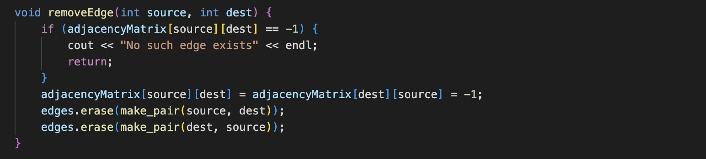
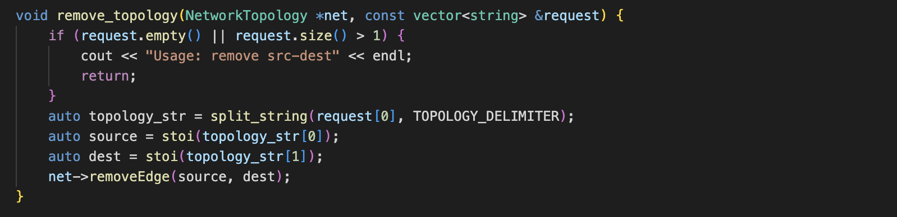

# NetworkTopology Class
#### addEdge(int source, int destination, int cost).

This method is used to add an edge to the network topology. It takes three parameters: source, destination, and cost. It checks if the source and destination nodes are the same and if the topology is already set between them. If not, it adds the edge to the adjacency matrix, updates the edges map, and keeps track of the maximum node count.

 

 

#### removeEdge(int source, int dest).

This method is used to remove an existing edge from the network topology. It takes two parameters: source and dest (destination). It checks if the edge exists in the adjacency matrix, and if so, it removes it from the matrix and the edges map.

 

 

#### modifyEdge(int source, int dest, int cost).

This method is used to modify the cost of an existing edge or add a new edge if it doesn't exist. It takes three parameters: source, dest (destination), and cost. It updates the adjacency matrix, edges map, and the maximum node count. If the edge already exists, it updates its cost; otherwise, it adds the new edge.

 

 

#### printAdjacencyMatrix().

This method prints the adjacency matrix of the network topology. It iterates over the matrix and prints its values in a formatted manner.

 

 

#### getCount().

This method returns the count of nodes in the network topology.

 

 

#### dijkstra(int src_node).

This method performs Dijkstra's algorithm to find the shortest path from a given source node (src_node) to all other nodes in the network. It initializes distance, parent, and test arrays, and then iteratively updates the distances until the shortest paths are found. It prints the intermediate steps and the final shortest paths.

 

 

#### print_parents(const int *parent, int j, stringstream &ss).

This method is a helper function used by the dijkstra method. It recursively prints the parents of a given node, forming the shortest path.

 

 

#### min_distance(const int distances[], const bool test[]).

This method is a helper function used by the dijkstra method. It finds the minimum distance node from the set of nodes not yet processed.

 

 

#### bellman_ford(int src_node).

This method performs the Bellman-Ford algorithm to find the shortest paths from a given source node (src_node) to all other nodes in the network. It initializes distance and parent arrays, and then iteratively relaxes the edges until the shortest paths are found. It prints the final shortest paths.

 

 
 

# Main
#### split_string(const string &str, char delimiter).

This function splits a string str into a vector of strings based on a given delimiter. It uses a stringstream to extract individual tokens from the string using getline() with the specified delimiter. The tokens are then added to a vector and returned as the result.

 

 

#### set_topology(NetworkTopology *net, const vector<string> &request).

This function sets the network topology based on a vector of strings request, where each string represents an edge in the format "source-destination-cost". It iterates over each string in request, splits it into separate components using split_string(), converts the components to integers, and then calls the addEdge() method of the NetworkTopology object net to add the edge to the topology.

 

 

#### lsrp(NetworkTopology *net, const vector<string> &request).

This function performs the Link State Routing Protocol (LSRP) on the network topology. If the request vector is not empty, it extracts the source node from the first element of the vector. It then calls the dijkstra() method of the NetworkTopology object net to find the shortest paths from the specified source node to all other nodes in the network. If the request vector is empty, it iterates over all nodes in the network using a loop and calls dijkstra() for each node.

 

 

#### dvrp(NetworkTopology *net, const vector<string> &request).

This function performs the Distance Vector Routing Protocol (DVRP) on the network topology. It follows a similar logic to the lsrp() function. If the request vector is not empty, it extracts the source node from the first element of the vector. It then calls the bellman_ford() method of the NetworkTopology object net to find the shortest paths from the specified source node to all other nodes in the network. If the request vector is empty, it iterates over all nodes in the network using a loop and calls bellman_ford() for each node.

 

 

#### modify_topology(NetworkTopology *net, const vector<string> &request).

This function modifies the network topology based on a vector of strings request, which should contain a single string in the format "source-destination-cost". It first checks if the request vector is empty or contains more than one element. If so, it prints a usage message and returns. Otherwise, it splits the single string in request using split_string(), converts the components to integers, and then calls the modifyEdge() method of the NetworkTopology object net to modify the edge between the specified source and destination nodes with the new cost.

 

 

#### remove_topology(NetworkTopology *net, const vector<string> &request).

This function removes an edge from the network topology based on a vector of strings request, which should contain a single string in the format "source-destination". Similar to modify_topology(), it checks the validity of the request vector and splits the string using split_string(). It converts the source and destination nodes to integers and then calls the removeEdge() method of the NetworkTopology object net to remove the specified edge from the topology.

 

 